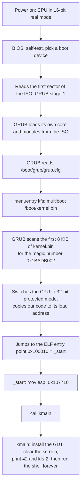

# How kfs-1 and kfs-2 work

Written for a programmer who is comfortable in C, C++, Python or TypeScript and
has never touched assembly, a kernel, or a bootloader. Unfamiliar words are
defined in [GLOSSARY.md](GLOSSARY.md).

Every address, byte value and size below was measured from the artifacts this
repo builds, with `objdump`, `readelf` and the QEMU monitor. Nothing here is
idealised.

## 1. The one idea you need first

Every program you have ever written ran **on top of** an operating system.
`printf`, `malloc`, `open`, `Promise`, `import` — all of those are requests to a
kernel. This project is the thing that would have answered them.

So take away everything the OS was doing for you:

| You are used to | Here |
|---|---|
| The loader picks addresses for your code | You write the addresses out by hand |
| `main` starts with a working stack | The stack pointer holds garbage until you set it |
| `printf` prints | Nothing prints. There is no console, only a grid of memory the screen happens to read |
| `malloc` gives you memory | There is no heap. Nobody wrote one yet |
| A segfault kills your process | Nobody kills anything. The machine reboots |
| Threads, files, sockets | None of it exists |

That last row is why the code is so small: there is nothing to call.

## 2. What exists today

Working:

- An assembly boot stub that sets up a stack and calls into Rust.
- A `no_std` Rust kernel whose entry point is `kmain`, plus the panic handler
  the language demands.
- The kernel's **own** Global Descriptor Table, installed before anything else
  runs: seven descriptors copied to physical `0x800`, and all six segment
  registers reloaded out of them. `cs` needs a far return, because no `mov`
  may write it. The layout, the install sequence and the proof are
  [GDT.md](GDT.md).
- A VGA text driver — clear, print, colours, a tracked cursor with line
  wrapping and scrolling, the blinking hardware cursor parked after our
  output — and `kmain` using it to display "42" and a green "kfs-2". The
  screen model and the module are [VGA.md](VGA.md).
- The start of a kernel library: C-string helpers for the multiboot data GRUB
  hands us, and number-to-text conversion. The displayed "42" actually goes
  through it.
- `printk!` — `core`'s whole formatting engine hooked onto the screen through
  one trait impl. Panics print themselves in red instead of silently freezing
  the machine.
- A polled PS/2 keyboard driver, Shift, Enter and Backspace included, and one
  module, `port.rs`, holding the `in` and `out` instructions its three callers
  share.
- Three virtual screens, switched with F1/F2/F3, each keeping its own
  contents, cursor and colour while off-screen.
- A debug shell behind a `kfs> ` prompt: a line editor over the keyboard
  driver, and six commands in a table (`stack`, `gdt`, `clear`, `reboot`,
  `halt`, `help`). It is [SHELL.md](SHELL.md).
- A hex dump of the live kernel stack, printed on demand from the real `esp`
  up to `stack_top`, 16 bytes to a row with an ASCII column beside them. It is
  [STACK.md](STACK.md).
- A custom compilation target: 32-bit x86, no floating-point hardware, no OS
  underneath.
- A linker script placing the kernel at 1 MiB with the multiboot header first,
  and a link that collects every unreached section: 17 828 bytes instead of
  150 112.
- A bootable GRUB ISO, 2 705 408 bytes (the subject's limit is 10 MiB).
- `make check`, twenty assertions made from outside the guest through the QEMU
  monitor: the segment registers, the descriptor bytes at `0x800`, the text in
  the VGA buffer, and the shell driven by injected keystrokes.

Deliberately absent:

- Interrupt handling, paging, a serial port, a memory allocator, user space.
  The user code, data and stack descriptors are in the table because the
  subject asks for them, but nothing runs in ring 3 yet: leaving ring 0 needs
  a way back in, and that means an IDT. Interrupts are also what will turn the
  keyboard from polled to event-driven. Both are the next KFS.

## 3. Power-on to `kmain`

A **bootloader** is a small program whose only job is to find a kernel, load it
into memory, and jump to it. We use GRUB, the standard Linux one, because
writing your own means talking to disk controllers in 16-bit mode.



Only three links in that chain are ours: the magic number GRUB looks for, the
`grub.cfg` line naming our binary, and `_start`. Everything before them is
firmware and GRUB doing their ordinary jobs.

### The handshake with GRUB

GRUB will not load an arbitrary file. It follows a published contract called
**multiboot**: put a recognisable 12-byte header near the front of your binary
and any compliant bootloader will load you and hand over a CPU already in
32-bit mode. Find the header, load and jump. Miss it, refuse the file. That is
the whole agreement, and our half of it is fourteen lines of `boot/boot.asm`.

### Why the stack has to come first

GRUB jumps to `_start` with interrupts off and the stack pointer register `esp`
holding **whatever was left in it** — an address that means nothing.

A function call pushes its return address onto the stack. That is true in C, in
Rust, in every compiled language. So calling *anything* before `esp` points at
real memory writes a return address into a random location and corrupts it.

And you cannot fix this in Rust, because Rust code needs a working stack in
order to run at all. "The stack does not exist yet" is not a state Rust can
express. That single problem is the entire reason there is an assembly file in
this repo.

## 4. The files that are the project

Everything else is documentation or build plumbing.

### `boot/boot.asm` — fourteen bytes of assembly

Assembly is one CPU instruction per line and no abstractions at all. NASM turns
this file into a 928-byte 32-bit object file. It contributes three pieces:

| Section | Size | What it is |
|---|---|---|
| `.multiboot` | 12 B | the header GRUB searches for |
| `.text` | 14 B | `_start` and a hang loop |
| `.bss` | 16 KiB | the kernel stack |

**The header** is three 32-bit numbers:

```nasm
MAGIC    equ 0x1BADB002          ; fixed value the spec mandates
FLAGS    equ MBALIGN | MEMINFO   ; 1<<0 | 1<<1 = 3
CHECKSUM equ -(MAGIC + FLAGS)    ; = 0xE4524FFB
```

The validity test is one line of arithmetic: the three must add up to zero in
32-bit maths. `0x1BADB002 + 3 + 0xE4524FFB = 0x100000000`, which overflows to
0. Here it is in the finished binary:

```
Contents of section .multiboot:
 100000 02b0ad1b 03000000 fb4f52e4
```

x86 stores numbers least-significant byte first, so those bytes read back as
`0x1BADB002`, `0x00000003`, `0xE4524FFB`. The build also checks this
independently with `grub-file --is-x86-multiboot build/kernel.bin`.

The two flags ask GRUB to page-align any modules it loads and to pass us a map
of physical memory. We ignore the map today; asking costs nothing and a future
memory allocator will want it.

**The stack** is 16 KiB of `.bss`, with both of its ends exported:

```nasm
section .bss
align 16
global stack_bottom
stack_bottom:
    resb 16384
global stack_top
stack_top:
```

`resb` means "reserve these bytes, do not store them in the file" — `.bss` is
memory the loader is told to hand over as zeros. Closer to `calloc` than to a
literal array of 16 384 zeros compiled into the binary. x86 stacks grow
*downwards*, so the starting `esp` is `stack_top`, the **higher** address.

The two `global` lines are new in kfs-2. Only the linker knows where `.bss`
landed, so `kernel::stack` cannot dump the stack with real bounds unless
`boot.asm` hands those two addresses over ([STACK.md](STACK.md)).

**`_start`** is where GRUB jumps. Disassembled from the real binary:

```
00100010 <_start>:
  100010: bc 10 77 10 00    mov  $0x107710,%esp
  100015: e8 d6 22 00 00    call 1022f0 <kmain>

0010001a <_start.hang>:
  10001a: fa                cli
  10001b: f4                hlt
  10001c: eb fc             jmp  10001a
```

`0x107710` is `stack_top` after the linker resolved it: `stack_bottom` at
`0x103710` plus 16 384. The hang loop below the `call` is unreachable while
`kmain` never returns, but it is the right thing to have there: `cli` switches
interrupts off, `hlt` stops the CPU until one arrives anyway, and the `jmp`
re-halts if something wakes it. Halting is not spinning — `hlt` lets a physical
CPU idle instead of burning a core at 100%.

`global _start` exports the name so the linker can find it, and the two
`global` lines around the stack do the same for `stack_bottom` and
`stack_top`. `extern kmain` promises the name exists somewhere else; the
linker fills in the address, `0x1022f0` in this build.

The trailing `.note.GNU-stack` line is an empty marker section. Without it,
modern `ld` warns that the stack might be executable. Cosmetic, two lines,
silent build.

### `kernel/src/lib.rs` — the kernel

```rust
#![no_std]

use core::panic::PanicInfo;

mod gdt;
mod keyboard;
mod klib;
mod port;
mod printk;
mod shell;
mod stack;
mod vga;

use printk::printk;

#[no_mangle]
pub extern "C" fn kmain() -> ! {
    unsafe { gdt::install() };
    vga::clear();
    let mut buf = [0u8; 10];
    vga::print(klib::utoa(42, &mut buf));
    vga::print("\n");
    vga::set_color(vga::Color::BrightGreen, vga::Color::Black);
    printk!("kfs-{}\n", 2);
    vga::set_color(vga::Color::White, vga::Color::Black);
    shell::run()
}

#[panic_handler]
fn panic(info: &PanicInfo) -> ! {
    vga::set_color(vga::Color::BrightRed, vga::Color::Black);
    printk!("\npanic: {}\n", info);
    loop { core::hint::spin_loop(); }
}
```

Read against what you already know:

| Written here | What it means |
|---|---|
| `#![no_std]` | Drop Rust's standard library; it assumes an OS. Keep `core`: integers, slices, `Option`, no I/O, no heap. In C terms: `-ffreestanding`, no libc. |
| `#[no_mangle]` | `extern "C"` in C++. Keep the symbol named literally `kmain`, because the assembly file wrote `call kmain`. |
| `extern "C"` | Use the C calling convention, so assembly and Rust agree on what a call looks like. |
| `-> !` | "Never returns." A promise to the compiler, and the reason the body has to end in something that never returns either, here `shell::run()`. |
| `#[panic_handler]` | Mandatory without `std`. A panic normally aborts the *process*; there are no processes. You must say where panics go. Ours spins forever. |

`gdt::install()` comes first, and it has to. Multiboot warns that the GDTR may
be invalid on entry, and that the kernel must not load a segment register, not
even with the same value, until it owns a table of its own. So nothing in
`kmain` may run before that line ([GDT.md](GDT.md)). Then the banner, then
`shell::run()`, which never returns.

`core::hint::spin_loop()` emits the x86 `pause` instruction — a hint that this
loop is waiting on something, which saves power and avoids a pipeline penalty.
It is where the kernel spends all of its time: the shell's line editor asks the
keyboard for a key and pauses when there is none. That is why the check finds
`EIP` inside `shell::run` (`0x100530`-`0x100f70`) whenever it samples the guest.

The panic handler prints the panic — location, message, formatted values — in
bright red before idling, which turns the failure mode from "screen freezes"
into an actual error report. Two things worth knowing about it:

- Printing from a panic reuses the very driver the panicking code may have
  been in the middle of. That is acceptable precisely because a panic is
  terminal: nothing runs afterwards, so corrupt-looking output is a cosmetic
  risk, not a correctness one.
- It is in the shipped binary now. In kfs-1 it was not: link-time optimisation
  proved no code path could actually panic, so the handler and all of
  `core::fmt` behind it were dead code and were dropped. That was measured by
  temporarily panicking in `kmain`, which grew `kernel.bin` from 2 016 to
  7 044 bytes and printed `panicked at src/lib.rs:21:5` in red on boot. The
  shell ended that: `dispatch` formats a runtime string and the line buffer is
  indexed at run time, so a panic is reachable again. `nm` now finds
  `rust_begin_unwind` at `0x100020` with `core::fmt`'s machinery behind it,
  which is part of why the kernel grew from 3 112 to 17 828 bytes.

### `kernel/src/klib.rs` — the start of a kernel library

The subject asks for "basic functions (strlen, strcmp, ...)" because a kernel
has no libc. In Rust most of that shelf already exists: `core` provides
`str::len` and slice comparison, and the build's `compiler-builtins-mem`
feature provides `memcpy`/`memset`/`memcmp`. What is genuinely missing are the
C-shaped pieces, so that is what `klib` holds:

- `strlen` / `strcmp` over NUL-terminated C strings — the format GRUB's
  multiboot info structure uses, which the memory-map work will need to read.
  No caller yet; they are `unsafe fn` because a raw pointer walk cannot be
  checked by the compiler.
- `utoa` — render a `u32` in decimal into a caller-provided buffer, no heap,
  no `core::fmt`. This one is live: `kmain` prints "42" by actually computing
  `utoa(42, &mut buf)`.

The punchline is what the optimiser did with that: `utoa(42)` is a pure
function of a constant, so LLVM evaluated the whole digit loop at compile
time — at the commit introducing it, the linked binary came out byte-for-byte
identical to the literal-string version. The helper is real, exercised on the
mandatory path, and free.

### `kernel/src/printk.rs` — printf without an OS

`core` cannot print — but it ships the complete formatting engine, held back
by one missing piece: somewhere for the text to go. The contract is
`core::fmt::Write`: implement a single method, `write_str`, and the trait
hands you `write_fmt` and with it every `{}`, `{:x}`, width and padding rule
Rust has. `vga::Writer` is that implementation (three lines: forward to
`vga::print`), and `printk!` wraps `core::format_args!` the way `println!`
does in userland. No allocation anywhere: `format_args!` compiles the format
string into a series of `write_str` calls at compile time.

This is the classic Rust-kernel move — the standard library's I/O is gone,
but the *language-level* machinery (traits, `format_args!`) never depended on
an OS in the first place.

### `kernel/src/keyboard.rs` — asking the keyboard instead of listening

The PS/2 keyboard does not send characters. Its 8042 controller (status port
`0x64`, data port `0x60`) delivers **scancodes** — numbers naming physical key
positions, press and release separately — and turning those into ASCII against
a layout table is the driver's whole job. Shift is just two more scancodes
whose press/release toggles a flag; F1-F3 come back as "switch screen"
commands rather than characters.

Polled, not interrupt-driven: the shell's line editor asks "anything for me?"
(status bit 0 on port `0x64`) on every lap of its loop, because the
alternative — the keyboard interrupting the CPU — needs an IDT, which is the
next KFS project. Polling burns the CPU politely (`pause`) and loses nothing at
human typing speed. The `in` instruction it needs comes from
`kernel/src/port.rs`.

### `kernel/src/vga.rs` — the screen driver

The screen is not a device you ask politely: it is 4 000 bytes of memory at
`0xb8000` that the display hardware repaints from sixty times a second. The
module writes u16 cells (colour byte + ASCII byte) into it through
`core::ptr::write_volatile` — `volatile` because these stores are never read
back, and a store whose result is unused is exactly what an optimiser deletes.
Public entry points — `clear()`, `set_color(fg, bg)`, `print(&str)`,
`put_char(u8)`, `backspace()`, `switch_screen(n)` — over a tracked write
position: `\n`, wrapping at column 80, scrolling at the bottom row, and the
blinking hardware cursor re-parked after each print through the CRT
controller's I/O ports (`outb`, from `kernel/src/port.rs`). Three virtual
screens live behind it: the active one exists only in the real buffer at
`0xb8000`; switching copies the live 4 000
bytes into the leaving screen's save slot and the entering screen's slot back
— contents, cursor and colour all travel. The full story — the cell format,
why `volatile`, the port I/O, the `.bss` trick that keeps 12 KiB of screen
slots out of the binary — is [VGA.md](VGA.md).

### `kernel/src/port.rs`: the other address space

Two functions, `inb` and `outb`, wrapping the x86 `in` and `out`
instructions. Devices on a PC answer at two kinds of address: memory-mapped
ones like the VGA text buffer live in ordinary RAM addresses, and the rest
live in a separate 65 536-slot space nothing but `in` and `out` can reach. The
CRT controller (`0x3D4`/`0x3D5`), the 8042 keyboard controller (`0x60`/`0x64`)
and the CPU reset line are all in that second space. `vga.rs` and
`keyboard.rs` each held a private copy of those two instructions and both gave
it up when `shell.rs` became the third caller: three copies of one `asm!` line
is the point where a shared module stops being ceremony.

### `kernel/src/gdt.rs`: the kernel's own segment table

x86 resolves every memory access through a segment descriptor, and until now
those descriptors were GRUB's. This module builds seven of its own (null,
kernel code/data/stack, user code/data/stack), copies them to physical
`0x800`, points the CPU at them with `lgdt`, and reloads all six segment
registers out of the new table. Every segment is flat (base 0, limit 4 GiB),
so the swap is invisible to every address already in flight, which is exactly
what makes it safe to perform while running. `cs` is the awkward one: no `mov`
may write it, so the code pushes a selector and a return address and runs
`retf`. The descriptor layout bit by bit, why the table is copied instead of
linked, why `0x800` is safe memory, and what happens if you skip the far
return: [GDT.md](GDT.md).

### `kernel/src/stack.rs`: a hex dump of the live stack

`esp()` reads the stack pointer in the *caller's* frame, `snapshot()` copies
bytes upward from there towards `stack_top`, and `print()` renders them 16 to
a row with an ASCII column beside the hex. Two attributes carry the module.
`esp()` is `#[inline(always)]`, because a real call would push a return
address first and so describe the wrong frame. `print()` is
`#[inline(never)]`, because its copy buffer has to sit *below* the captured
`esp`, and it only does while the function owns a frame of its own: inlined
once, every read past the start of the buffer returned a byte the copy had
already written, and the dump came out periodic with a 64-byte period, a
failure that looks exactly like real stack content. The window, the copy, the
row format and the reason there is no frame-pointer backtrace:
[STACK.md](STACK.md).

### `kernel/src/shell.rs`: a prompt and six commands

Not a POSIX shell: a prompt, a line, and a name looked up in a table of six
commands (`stack`, `gdt`, `clear`, `reboot`, `halt`, `help`). `CMDS` is a
table rather than a `match`, so `help` is a loop over the same rows the
dispatcher searches and a command cannot exist without its own help line. That
is the same choice as the scancode tables in `keyboard.rs` and the palette in
`vga.rs`. It exists because the two things kfs-2 adds are worth asking for at
a moment you choose, rather than watching them scroll past at boot. The line
editor, each of the six commands, and how `tools/check.sh` drives the whole
thing from outside the guest: [SHELL.md](SHELL.md).

### `linker.ld` — where the code lands in RAM

Normally the compiler, the linker's default script and the OS loader agree on
addresses without asking you. Here none of them exist, so you write it out:

```ld
ENTRY(_start)
SECTIONS
{
    . = 1M;
    .multiboot : { KEEP(*(.multiboot)) }
    .text      : { *(.text*) }
    .rodata    : { *(.rodata*) }
    .data      : { *(.data*) }
    .got       : { *(.got*) }
    .bss       : { *(COMMON) *(.bss*) }
    /DISCARD/  : { *(.eh_frame*) *(.comment) }
}
```

`.` is the location counter: the address currently being handed out. Four
decisions matter in those few lines.

**Start at 1 MiB.** The first megabyte of physical memory is not ours:

| Range | What lives there |
|---|---|
| `0x00000000`-`0x000003FF` | the real-mode interrupt vector table |
| `0x00000400`-`0x000004FF` | the BIOS data area |
| `0x00000500`-`0x00007BFF` | free conventional memory, and **the kernel's descriptor table sits at `0x00000800`-`0x00000837`** |
| `0x00010000`-`0x0009FFFF` | GRUB's own working memory, its multiboot information structure included |
| `0x000B8000` | the VGA text buffer |
| `0x00100000` | 1 MiB: the conventional first address a loaded kernel may claim, and where this image is linked |

That descriptor table is the one thing this kernel deliberately puts below 1
MiB, and it gets there by a copy at run time rather than by the linker.
`0x800` is inside the free window, 8-byte aligned as Intel recommends, and
nowhere near the memory GRUB is still using while it loads the image
([GDT.md](GDT.md)).

**`.multiboot` first, and wrapped in `KEEP`.** First, so the header lands
inside the 8 KiB window GRUB scans. `KEEP`, because nothing in the program
refers to that header at all, since GRUB finds it by scanning the file, and
`--gc-sections` collects precisely that kind of section. Without `KEEP` the
build still succeeds, the header is gone, and the ISO stops booting.

**A `.got` output section.** Some symbol references go through a global offset
table, and `ld` produces one whether or not the script mentions it. Naming it
puts those twenty bytes where they belong instead of leaving `ld` to place an
orphan section wherever it likes.

**`/DISCARD/` for `.eh_frame` and `.comment`.** Unwind tables describe how to
walk back out of a panic, and this kernel aborts instead, so nothing ever
reads them. `.comment` is toolchain version strings. Neither belongs in a
kernel image.

`*(.text*)` gathers `.text` out of every input file — our `boot.o` plus every
object inside `libkernel.a` — into one output section. The result:

| Section | Address | Size | Notes |
|---|---|---|---|
| `.multiboot` | `0x100000` | 12 B | magic, flags, checksum |
| `.text` | `0x100010` | 12 107 B | `_start`, `kmain`, the shell, the drivers, and `core::fmt` |
| `.rodata` | `0x102f5c` | 1 631 B | the two scancode tables, the command names and help lines, the segment names, the shell's other literal text |
| `.data` | `0x1035bc` | 312 B | the VGA colour attribute's initial value, compiler leftovers |
| `.got` | `0x1036f4` | 20 B | the global offset table `ld` produced |
| `.bss` | `0x103710` | 28 421 B | the stack (16 KiB), three screen save slots (12 KiB), driver state; never stored on disk |

The ELF ends up with a single loadable chunk: 14 088 bytes on disk expanding
to 42 517 bytes in RAM, the difference being the `.bss` the loader must
provide but never reads from the file — including the three 4 KiB screen
slots, kept deliberately zero-initialised so they cost nothing on disk
([VGA.md](VGA.md)). `build/kernel.bin` is 17 828 bytes total; the rest is ELF
bookkeeping. `.bss` beginning at `0x103710` is also where `stack_bottom`
lands, so in this build the 16 KiB stack runs from there up to `stack_top` at
`0x107710`.

The link command:

```sh
ld -m elf_i386 -n -nostdlib --gc-sections -T linker.ld -o build/kernel.bin \
   build/boot.o kernel/target/i686-kfs/release/libkernel.a
```

`-m elf_i386` asks for 32-bit x86 output, since the host `ld` defaults to
64-bit. `-n` switches off page-alignment of sections, keeping the image small
and the layout literal. `-nostdlib` links no host library at all, and the
build checks the result of that promise with `nm -u`. `--gc-sections` drops
every section nothing reaches from `_start`, which is worth a factor of eight
here and is why `.multiboot` needs `KEEP`; the measurement is in the `Makefile`
section below. `-T` supplies our script instead of the host's default.

> The subject forbids reusing the host's linker *script*, not the host's
> linker. `ld` is a tool; `linker.ld` is ours.

### `kernel/i686-kfs.json` — inventing a platform

You normally pick a target off a shelf: `x86_64-apple-darwin`,
`i686-unknown-linux-gnu`. Every one of those names an operating system, and
that is a lie here. There is no shelf entry for "32-bit x86, nothing
underneath", so the spec sheet is written by hand:

| Field | Why |
|---|---|
| `"llvm-target": "i686-unknown-none"` | 32-bit x86, no OS |
| `"data-layout"` | type sizes and alignments for i686; must match the LLVM target or codegen is subtly wrong |
| `"arch": "x86"`, `"target-pointer-width": 32` | 32-bit pointers |
| `"cpu": "pentium4"` | the baseline instruction set to compile for |
| `"os": "none"` | no syscalls, no libc assumptions |
| `"panic-strategy": "abort"` | there is no unwinder to unwind into |
| `"features": "-mmx,-sse,+soft-float"` | forbid the vector units, do float maths in software |
| `"rustc-abi": "softfloat"` | consistent with the above: floats travel in integer registers |
| `"disable-redzone": true` | the red zone is 128 bytes below `esp` a function may scribble in without reserving. Legal in userland, fatal once interrupt handlers exist — they push data there and silently eat it |
| `"max-atomic-width": 64` | 64-bit atomics work on this CPU via `cmpxchg8b` |
| `"linker-flavor"`, `"linker"` | only used if cargo does the linking. We link ourselves, so these are inert |

The SSE line is the one worth understanding. Floating-point and vector units on
x86 have to be switched on explicitly after boot, by setting bits in CPU
control registers. If the optimiser emitted a single SSE instruction before
that happened, the CPU would raise an exception, find no handler installed, and
triple-fault. Banning an instruction set we do not use is cheaper than
initialising hardware we do not need.

Worth noticing what the file does *not* say: there is no `frame-pointer`
setting, so rustc omits the frame pointer wherever it can and `ebp` is an
ordinary register in this kernel. That is why the `stack` command prints bytes
and not a backtrace: a walk through `[ebp]` would print structured-looking
nonsense ([STACK.md](STACK.md)).

Because no prebuilt standard library exists for a target we just invented,
`kernel/.cargo/config.toml` rebuilds one from source:

```toml
[build]
target = "i686-kfs.json"

[unstable]
json-target-spec = true
build-std = ["core", "compiler_builtins"]
build-std-features = ["compiler-builtins-mem"]
```

`build-std` compiles `core` and `compiler_builtins` for our target.
`compiler-builtins-mem` supplies `memcpy`, `memset` and `memcmp` in Rust: LLVM
emits calls to those names for struct copies and slice operations, and on a
normal system libc provides them. We have no libc. `json-target-spec` is what
permits `.json` target files on current nightly at all, and nightly itself is
required because rebuilding `core` is an unstable feature — pinned in
`rust-toolchain.toml` so `rustup` handles it without manual juggling.

`Cargo.toml` asks for `lto = true` with a single codegen unit: whole-program
link-time optimisation across `core` and our own code. In kfs-1 that was
enough to prove `core::fmt` unreachable and drop it entirely, measured when
`printk` landed: 2 KB to 430 KB without LTO, back to 2 KB with it. The shell
formats runtime values, so that machinery stays in the binary now, and what
LTO buys is inlining and dead-code removal inside what is left. And
`Cargo.toml` asks for `crate-type = ["staticlib"]`, so cargo produces
`libkernel.a` (366 954 bytes) instead of an executable: a bag of parts for our
own `ld` invocation to assemble, rather than a finished program linked with the
wrong script. `panic = "abort"` in both profiles strips the unwinding
machinery, which would otherwise want a runtime we do not have.

### `grub.cfg` — the boot menu

```
set timeout=0
set default=0
menuentry "kfs" {
    multiboot /boot/kernel.bin
    boot
}
```

`timeout=0` boots straight through with no menu. `multiboot` is the GRUB
command that loads a multiboot-1 kernel: it validates the header, copies the
image to its load address and enters 32-bit protected mode. `boot` transfers
control. The path is inside the ISO, not on your machine — `make` stages
`build/iso/boot/kernel.bin` and `build/iso/boot/grub/grub.cfg` before calling
`grub-mkrescue`.

### `Makefile` — four artifacts in order

```
boot/boot.asm ──nasm -f elf32──────────────► build/boot.o        (928 B)
kernel/src/*  ──cargo build --release──────► libkernel.a         (366 954 B)
both          ──ld --gc-sections -T ...────► build/kernel.bin    (17 828 B)
kernel.bin    ──grub-mkrescue──────────────► kfs.iso             (2 705 408 B)
```

A 17 KB kernel still produces a 2.7 MB image, because `grub-mkrescue` copies
GRUB itself and its module tree onto the ISO. The three empty flags
`--fonts= --locales= --themes=` are what holds it to that: Fedora's GRUB data
directory carries a 2.4 MiB Unicode font and several megabytes of
translations, and one English `menuentry` needs none of them.

**`--gc-sections` is the link flag worth understanding.** It tells `ld` to
drop every section nothing reaches from `_start`, and here that changes the
size of the binary by a factor of eight. The reason is how `compiler_builtins`
is built: rustc emits it as *one* object file, so needing a single helper out
of it (`memcpy`, a 64-bit divide) makes `ld` pull the whole 318 KiB member
in, soft-float `f128` mathematics included. Measured: `kernel.bin` was 150 112
bytes without the flag and is 17 828 bytes with it, with no float symbol left
in `nm`'s output. The price is that a section nothing refers to is collected,
and the multiboot header is exactly such a section, hence the `KEEP` in
`linker.ld`.

Worth knowing:

- GRUB's tool names are auto-detected: Fedora ships `grub2-mkrescue` and
  `grub2-file`, Debian ships `grub-mkrescue` and `grub-file`.
- `cargo` is a **phony** target. Cargo's own change detection is better than
  anything Make could model for Rust, so Make always delegates. The cost is
  that `kernel.bin` relinks every build, and linking 17 KB is free.
- Four assertions run inside the build rather than as separate steps:
  `grub-file --is-x86-multiboot` on the linked binary; `nm -u` on it, because
  an undefined symbol there is a host library the kernel expects and GRUB
  cannot provide, which is precisely what `-nostdlib` promises will not
  happen; a size check that fails the build above 10 485 760 bytes; and an
  El Torito check on the ISO, because without the GRUB i386-pc modules
  `grub-mkrescue` writes a bootless image and reports success. Two of the four
  print an `OK:` line, and those two are the first two assertions of section 6;
  the other two say nothing unless they fail.
- `check` is a single line: it hands the ISO to `tools/check.sh`, which holds
  the twenty assertions of section 6.
- `clean` / `fclean` / `re` follow 42 conventions. `clean` also runs
  `cargo clean`, or `kernel/target` (hundreds of MB) would survive it.
- `docker-%` is a pattern rule: `make docker-check` builds the dev image and
  runs `make check` inside it. There is no separate in-container logic — the
  container runs the same native rules against the bind-mounted repo. It exists
  because this development machine is arm64 macOS with no x86 toolchain;
  evaluation on Fedora never uses it.

## 5. What the screen shows

Boot the ISO and you get a black screen, a white "42" on the first row, a
bright-green "kfs-2" on the second, one white line of hint text, and a
bright-cyan `kfs> ` prompt with the cursor blinking after it. Type a command,
press Enter, and the shell answers. Shift, Enter and Backspace all behave,
and F1/F2/F3 switch between three independent screens even in mid-line. Each
part of the boot picture has a cause:

1. **The black screen** is `vga::clear()`: 2 000 cells overwritten with a
   white-on-black space, erasing the grey text GRUB printed while loading.
   Before this existed, GRUB's leftovers stayed lit forever — nothing else
   ever wrote to the buffer.
2. **The "42"** is `kmain` printing `klib::utoa(42, ...)`: two white-on-black
   cells at `0xb8000` and `0xb8002`, the top-left of the grid. **The
   "kfs-2"** is the same path after `set_color(BrightGreen, Black)`.
3. **The prompt** is `shell::run`, the last thing `kmain` calls and a function
   that never returns: the hint line, then `kfs> ` in bright cyan, then a line
   collected one scancode at a time ([SHELL.md](SHELL.md)).
4. **The cursor** is hardware state, not a character: it lives in CRT
   controller registers reached through I/O ports `0x3D4`/`0x3D5`, and the
   driver re-parks it after each print, and just past the prompt is where the
   output ends. It blinks with the attribute of the cell it sits on,
   which `clear()` painted white-on-black. (Before the driver programmed it, it
   just blinked wherever GRUB abandoned it.)

None of that is inherited, and neither is the segmentation underneath it:
`gdt::install()` runs before the first `vga::clear()`, so every address on the
screen path resolves through the kernel's own descriptors ([GDT.md](GDT.md)).

Real failures look different:

| Symptom | Diagnosis |
|---|---|
| BIOS splash and GRUB menu reappear in a loop | triple fault: the CPU faulted, faulted handling that, gave up and reset |
| A GRUB error instead of `Booting` | bad multiboot header, or a wrong path in `grub.cfg` |
| `EIP` below `0x100000` | execution left the kernel: bad jump, or the image never loaded |
| QEMU monitor unreachable | the process died outright |

## 6. How we prove it works

You cannot `assert` from inside this kernel. There is no test harness, no
process to exit with a status, and nowhere to report a result to. So `make
check` hands the ISO to `tools/check.sh`, and that script is a unit test for a
whole machine: it boots the image headless and interrogates the emulator from
the outside. Twenty assertions, and nothing inside the guest takes part in any
of them.

The whole conversation goes over QEMU's human monitor on a unix socket
(`-display none -monitor unix:/tmp/kfs-mon,server,nowait`, driven with
`socat`). Three of the commands read, one writes:

| Monitor command | What it does |
|---|---|
| `info registers` | reports `EIP`, the six segment registers, `GDT=base limit`, `ESP` and the `HLT` flag |
| `xp/14wx 0x800` | reads guest *physical* memory: the fourteen words of the descriptor table |
| `xp/2000hx 0xb8000` | reads the VGA text buffer, all 2 000 cells |
| `sendkey <key>` | injects one keystroke into the guest's 8042 queue |

Two details make that work. The screen assertions decode the **low** byte of
each cell, which is the character code, so they compare exact text instead of
guessing at pixel colour: `screendump` and its greps for pure white and for
GRUB's grey `#a8a8a8` are gone, and with them the old constraint that kept dim
palette colours off the boot screen. And `sendkey` has no string form, so a
command is typed one key per monitor round trip; the injected key lands in the
8042's output queue, the status bit on port `0x64` goes high from queue
occupancy alone, and the polled driver reads it with no interrupt involved. The
monitor echoes every character typed at it, which is why the script only reads
hex out of lines that begin with an address and a colon.

The twenty assertions, in the order they run:

```
OK: build/kernel.bin is freestanding (no undefined symbols)
OK: kfs.iso is 2705408 bytes (limit 10485760)
OK: guest alive, EIP=001008a7 inside the kernel
OK: GDT at 0x00000800, limit 0x00000037 (7 descriptors)
OK: cs=0008 ss=0018 ds=es=fs=gs=0010, all from the new table
OK: null + kernel code/data/stack + user code/data/stack at 0x800
OK: row 0 shows the mandatory "42"
OK: row 1 shows the kfs-2 banner
OK: shell prompt is on screen
OK: `help` lists the commands
OK: `gdt` reads the table back from the CPU and agrees with the source
OK: `clear` blanked the screen
OK: header is self-consistent: 168 of 16384 bytes below 0x00107710
OK: 168 bytes rendered as 11 rows of 16
OK: first row starts at 0x00107668, the address the header names
OK: the first dword is 0x0010063c, a return address inside the kernel
OK: the ASCII column shows the typed command in the line buffer
OK: dump esp 0x00107668 is 4 bytes deeper than ESP=0x0010766c
OK: `reboot` restarted the machine, and the table came back at 0x00000800
OK: `halt` stopped the processor (HLT=1)
```

They read as four groups.

**The machine is alive, and it is ours.** `EIP` has to land inside
`[0x100000, 0x200000)`. Both bounds matter: GRUB runs below 1 MiB *and*,
relocated, near the top of RAM (`EIP=0x07f7d106` was observed mid-boot), so
"at least 1 MiB" alone can pass too early. Polled for up to 60 s rather than
slept for a fixed time, because an emulated container boots several times
slower than the host does.

**The descriptor table is installed and in use.** The `GDT=` line comes from
the CPU's own register, which only `lgdt` writes. The six segment register
values cannot be inherited, because GRUB hands over `cs=0x0010` with the data
registers at `0x0018`. And the fourteen words at `0x800` are compared against
the source byte for byte, with one bit masked out: the CPU writes the accessed
bit into a descriptor in memory the first time its selector loads, so an
authored `0x92` reads back as `0x93` ([GDT.md](GDT.md)).

**The screen holds what the subject asks for.** "42" on row 0, the `kfs-2`
banner on row 1, a `kfs>` prompt somewhere on the screen, and each of `help`,
`gdt` and `clear` doing what its own help line claims.

**The stack dump describes the live stack.** The header is checked against
itself (top minus esp equals the byte count, and the size is the 16 384 bytes
`boot.asm` reserves), the row count against the byte count, the first row's
address against the header, the first dword against the kernel's address
range, and finally the dumped `esp` against the `ESP` the monitor reports: 4
bytes deeper, because the guest is parked one frame shallower than the dump was
taken in ([STACK.md](STACK.md)).

`reboot` and `halt` come last, because they end the run. One proves the kernel
comes back with its table at the same address, which is also what makes
`gdt::install` safe to run at every boot; the other proves the processor really
stopped, from the monitor's `HLT=1` rather than from a screen that stopped
changing.

`make re` is the other check that matters: a full `fclean` and rebuild proves
the clean targets really remove everything and that the build works from
nothing.

## 7. Toolchain the numbers came from

```
NASM 2.16.01
GNU ld (Binutils) 2.40
rustc 1.100.0-nightly
grub-mkrescue (GRUB) 2.06
QEMU 7.2.22 (qemu-system-i386)
```

Sizes and addresses shift a little with other versions. The structure does not.
