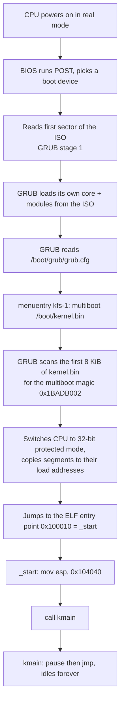

# How kfs-1 works

This document explains every piece of the current kernel: what exists, what
each file contributes, and what the machine actually does between power-on and
the kernel's idle loop. Unfamiliar words are defined in
[GLOSSARY.md](GLOSSARY.md).

Everything below is measured from the artifacts this repo builds, not
idealised: addresses, sizes and byte values come from `objdump`/`readelf` on
`build/kernel.bin` and from the QEMU monitor on a running guest.

## 1. Status

Implemented:

- A multiboot-compliant boot stub in assembly that sets up a stack and calls
  into Rust.
- A `no_std` Rust kernel whose entry point is `kmain`, plus the panic handler
  the language requires.
- A custom bare-metal compilation target (32-bit x86, no floating-point
  hardware, no operating system underneath).
- A linker script that places the kernel at 1 MiB with the multiboot header
  first.
- A bootable GRUB ISO image, 5 083 136 bytes (the subject's limit is 10 MiB).
- A `make check` target that proves the kernel is really executing.

Not implemented yet, deliberately:

- **Screen output.** `kmain` does nothing but idle. The subject's mandatory
  "display 42" is designed in [VGA.md](VGA.md) and delivered separately.
- Interrupt handling (IDT), segmentation setup (GDT), paging, keyboard,
  serial port, memory allocator, user space. None of it is needed to boot.

## 2. The chain of custody, power-on to `kmain`



Three things in that chain are ours: the multiboot header GRUB looks for, the
`grub.cfg` line that names our binary, and `_start`. Everything before them is
firmware and GRUB doing their standard jobs.

### Why the handoff needs a stack first

GRUB jumps to `_start` with the CPU in 32-bit protected mode, interrupts
disabled, and `esp` **undefined**. A `call` instruction pushes a return address
onto the stack, so calling any function before pointing `esp` at real memory
would corrupt whatever `esp` happened to contain. Hence the two instructions in
`_start`: set the stack, then call.

That is the entire purpose of the assembly file. Rust cannot express "the
stack pointer does not exist yet".

## 3. File by file

### `boot/boot.asm` — the boot stub

Assembled by NASM into a 32-bit ELF object file: `nasm -f elf32` → 928 bytes of
`build/boot.o`.

It contributes three sections:

| Section | Size | Contents |
|---|---|---|
| `.multiboot` | 12 B | the header GRUB searches for |
| `.text` | 14 B | `_start` and the hang loop |
| `.bss` | 16 KiB | the kernel stack, reserved but not stored in the file |

**The multiboot header** is three 32-bit words:

```nasm
MAGIC    equ 0x1BADB002          ; fixed value the spec mandates
FLAGS    equ MBALIGN | MEMINFO   ; 1<<0 | 1<<1 = 3
CHECKSUM equ -(MAGIC + FLAGS)    ; = 0xE4524FFB
```

`MAGIC + FLAGS + CHECKSUM` must wrap to zero in 32-bit arithmetic; that is the
whole validity test. `0x1BADB002 + 3 + 0xE4524FFB = 0x100000000`, which
truncates to 0. GRUB only searches the first 8 KiB of the file, which is why
the linker script puts this section first. Verified in the final binary:

```
Contents of section .multiboot:
 100000 02b0ad1b 03000000 fb4f52e4
```

Little-endian, so those bytes read back as `0x1BADB002`, `0x00000003`,
`0xE4524FFB`. `make` also asserts it independently with
`grub-file --is-x86-multiboot build/kernel.bin`.

The two flags request that GRUB page-align any modules it loads (`MBALIGN`) and
pass a memory map in the multiboot info structure (`MEMINFO`). We ignore that
information today — it costs nothing to ask for and a later step (a physical
memory allocator) will need it.

**The stack** is 16 KiB of `.bss`:

```nasm
section .bss
align 16
stack_bottom:
    resb 16384
stack_top:
```

`resb` reserves bytes without putting them in the file — `.bss` is zeroed
memory, so storing 16 KiB of zeros on disk would be waste. x86 stacks grow
*downwards*, so the initial `esp` is `stack_top`, the higher address. `align 16`
satisfies the ABI's stack alignment expectation.

**`_start`** is the ELF entry point:

```
00100010 <_start>:
  100010: bc 40 40 10 00    mov  $0x104040,%esp
  100015: e8 16 00 00 00    call 100030 <kmain>

0010001a <_start.hang>:
  10001a: fa                cli
  10001b: f4                hlt
  10001c: eb fc             jmp  10001a
```

`0x104040` is `stack_top` resolved by the linker: `stack_bottom` at `0x100040`
plus `0x4000` (16 384). The hang loop after the `call` is unreachable while
`kmain` is `-> !`, but it is the correct thing to have there: `cli` disables
interrupts, `hlt` halts the CPU until the next one, and the `jmp` re-halts if
some non-maskable event wakes it. Halting is not the same as spinning — `hlt`
lets the physical CPU idle instead of burning a core.

`extern kmain` tells NASM the symbol lives elsewhere; the linker resolves it.
`global _start` exports the symbol so the linker script's `ENTRY(_start)` can
find it.

The trailing `section .note.GNU-stack noalloc noexec nowrite progbits` is an
empty marker section. Modern `ld` warns "missing .note.GNU-stack section
implies executable stack" without it. Cosmetic, but a clean build is worth two
lines.

### `kernel/` — the Rust kernel

`kernel/src/lib.rs` is 20 lines and contains exactly two items:

```rust
#![no_std]

#[no_mangle]
pub extern "C" fn kmain() -> ! {
    loop { core::hint::spin_loop(); }
}

#[panic_handler]
fn panic(_info: &PanicInfo) -> ! {
    loop { core::hint::spin_loop(); }
}
```

- `#![no_std]` drops the standard library. `std` assumes an operating system —
  files, threads, heap, syscalls — none of which exist here. We keep `core`:
  the OS-independent half of the language (integers, slices, `Option`, atomics,
  `PanicInfo`).
- `#[no_mangle]` keeps the symbol literally named `kmain` rather than a mangled
  one. The assembler wrote `call kmain`, so the symbol must match exactly. For
  comparison, the panic handler is mangled and shows up in the symbol table as
  `_RNvCsj5li9sZI3iI_7___rustc17rust_begin_unwind`.
- `extern "C"` selects the C calling convention rather than Rust's unspecified
  one, so assembly and Rust agree on how a call works.
- `-> !` means "never returns". That is a promise to the compiler; it is why the
  function must end in an infinite loop and why nothing after `call kmain` can
  run.
- `core::hint::spin_loop()` emits the x86 `pause` instruction (`f3 90`). It is a
  hint to the processor that this is a spin-wait: it saves power and avoids a
  pipeline penalty. The whole function compiles to four bytes:

  ```
  00100030 <kmain>:
    100030: f3 90     pause
    100032: eb fc     jmp 100030
  ```

- `#[panic_handler]` is mandatory in `no_std`: the language needs somewhere to
  go when a panic happens, and there is no runtime to unwind into. Ours halts.
  In the binary it sits at `0x100020`, under the mangled name above.

Supporting files:

- `Cargo.toml` — `crate-type = ["staticlib"]` makes `cargo` emit
  `libkernel.a` (752 190 bytes), an archive of object files that our own `ld`
  invocation consumes. `panic = "abort"` in both profiles removes unwinding
  machinery, which would otherwise want a runtime we do not have.
- `rust-toolchain.toml` — pins `nightly` and the `rust-src` component. Nightly
  is required because building `core` from source for a custom target is an
  unstable feature. `rustup` reads this file automatically, so no manual
  toolchain juggling.
- `.cargo/config.toml`:

  ```toml
  [build]
  target = "i686-kfs.json"

  [unstable]
  json-target-spec = true
  build-std = ["core", "compiler_builtins"]
  build-std-features = ["compiler-builtins-mem"]
  ```

  `build-std` compiles `core` and `compiler_builtins` from source for our
  target — no precompiled standard library exists for a target we invented.
  `compiler-builtins-mem` provides `memcpy`, `memset`, `memcmp` and friends in
  Rust; LLVM emits calls to those symbols for struct copies and slice
  operations, and normally libc supplies them. We have no libc.
  `json-target-spec` is the flag that permits `.json` target files at all on
  current nightly.

- `i686-kfs.json` — the custom target definition. Every field earns its place:

  | Field | Why |
  |---|---|
  | `"llvm-target": "i686-unknown-none"` | 32-bit x86, no OS |
  | `"data-layout"` | LLVM's type sizes/alignments for i686; must match the LLVM target |
  | `"arch": "x86"`, `"target-pointer-width": 32` | 32-bit pointers |
  | `"cpu": "pentium4"` | baseline instruction set to compile for |
  | `"os": "none"` | freestanding: no syscalls, no libc assumptions |
  | `"panic-strategy": "abort"` | matches `Cargo.toml`; no unwinder exists |
  | `"features": "-mmx,-sse,+soft-float"` | forbid MMX/SSE, do float math in software |
  | `"rustc-abi": "softfloat"` | tells rustc the ABI passes floats in integer registers, consistent with the above |
  | `"disable-redzone": true` | the red zone is unsafe once interrupt handlers exist — they would clobber it |
  | `"max-atomic-width": 64` | 64-bit atomics are available via `cmpxchg8b` |
  | `"linker-flavor": "ld.lld"`, `"linker": "rust-lld"` | only used if cargo links; we link ourselves with `ld`, so these are inert for a `staticlib` |

  Disabling SSE matters: the FPU and SSE units need explicit enabling
  (`CR0`/`CR4` bits) after boot. If the compiler emitted an SSE instruction
  before that happens, the CPU raises an exception and, with no handler
  installed, the machine triple-faults. Forbidding the instruction set is
  cheaper than initialising hardware we do not use.

### `linker.ld` — where things land in memory

```ld
ENTRY(_start)
SECTIONS
{
    . = 1M;
    .multiboot : { *(.multiboot) }
    .text      : { *(.text*) }
    .rodata    : { *(.rodata*) }
    .data      : { *(.data*) }
    .bss       : { *(COMMON) *(.bss*) }
}
```

`.` is the location counter — the address being assigned. Setting it to `1M`
places the kernel at `0x100000` because the first megabyte of physical memory
is not ours: it holds the real-mode interrupt vector table, BIOS data, the VGA
framebuffer at `0xb8000`, and memory-mapped ROM. 1 MiB is the conventional
first address a loaded kernel may own.

Order is load-bearing: `.multiboot` must come first so the header lands inside
the 8 KiB window GRUB scans. `*(.text*)` gathers `.text` from every input file
— our `boot.o` plus every object inside `libkernel.a` — into one output
section.

The result:

| Section | Address | Size | Notes |
|---|---|---|---|
| `.multiboot` | `0x100000` | 12 B | magic, flags, checksum |
| `.text` | `0x100010` | 36 B | `_start`, `rust_begin_unwind`, `kmain` |
| `.bss` | `0x100040` | 16 KiB | the stack; `NOBITS`, not stored on disk |

`.rodata` and `.data` are empty and get dropped. The ELF has one `LOAD` segment
with `FileSiz 0x34` (52 bytes on disk) and `MemSiz 0x4040` (16 448 bytes in
RAM) — the difference is the `.bss` the loader must provide but never reads
from the image. The file on disk is 1 012 bytes; `size` reports 48 bytes of
loadable non-`.bss` content (the 12-byte header plus 36 bytes of code) and
16 384 bytes of `.bss`. The rest of the file is ELF metadata.

The link line is:

```sh
ld -m elf_i386 -n -T linker.ld -o build/kernel.bin \
   build/boot.o kernel/target/i686-kfs/release/libkernel.a
```

`-m elf_i386` selects the 32-bit x86 output format (the host `ld` defaults to
64-bit). `-n` turns off page-alignment of sections, keeping the image compact
and the layout literal. `-T` supplies our script instead of the host's default
one.

> The subject forbids reusing the host's linker script but not the host's
> linker. `ld` is a tool; `linker.ld` is ours.

### `grub.cfg` — the boot menu

```
set timeout=0
set default=0
menuentry "kfs-1" {
    multiboot /boot/kernel.bin
    boot
}
```

`timeout=0` boots immediately with no menu. `multiboot` is GRUB's command for
loading a multiboot-1 kernel — it is what validates the header, moves the
segments and enters protected mode. `boot` transfers control.

The path is inside the ISO, not the host filesystem: `make` stages
`build/iso/boot/kernel.bin` and `build/iso/boot/grub/grub.cfg` before calling
`grub-mkrescue`.

### `Makefile` — the pipeline

Four artifacts, in order:

```
boot/boot.asm ──nasm -f elf32──────────────► build/boot.o        (928 B)
kernel/src/*  ──cargo build --release──────► libkernel.a         (752 KB)
both          ──ld -m elf_i386 -n -T ...───► build/kernel.bin    (1 012 B)
kernel.bin    ──grub-mkrescue──────────────► kfs.iso             (5 083 136 B)
```

Details worth knowing:

- Tool names live in variables, and GRUB's are auto-detected because Fedora
  ships `grub2-mkrescue`/`grub2-file` while Debian ships `grub-mkrescue`/
  `grub-file`.
- `cargo` is a **phony** target: cargo has its own, better change detection, so
  Make always delegates rather than trying to model Rust dependencies. The cost
  is that `kernel.bin` relinks every build — a link of 1 KB is free.
- Two assertions run inside the build, not as separate steps: `grub-file
  --is-x86-multiboot` on the linked binary, and a size check that fails the
  build if the ISO exceeds 10 485 760 bytes.
- `clean` / `fclean` / `re` follow 42 conventions. `clean` also runs
  `cargo clean`, otherwise `kernel/target` (hundreds of MB) survives.
- `docker-%` is a pattern rule: `make docker-check` builds the dev image and
  runs `make check` inside it. There is no separate in-container logic — the
  container runs the same native rules against the bind-mounted repo. It exists
  because the development machine is arm64 macOS with no x86 toolchain;
  evaluation on Fedora never uses it.

## 4. What the machine is doing right now

Boot the ISO and the screen stops at `Booting "kfs-1"` with a blinking cursor
below it. That is the expected, correct end state, and the reasoning is worth
following because it is the same reasoning used to debug a real hang:

1. GRUB printed that line, then loaded and jumped to our kernel.
2. `kmain` is `pause; jmp` — it never writes to the screen. Nothing clears the
   VGA text buffer, so GRUB's last message stays visible forever. The kernel
   is not stuck *at* GRUB; GRUB's output is just the last thing anything drew.
3. Measured evidence, two samples 15 s apart on one boot: `EIP=0x00100032`
   both times — the `jmp` inside `kmain`, which sits at `0x100030`. Between the
   samples only 18 pixels changed, a 9×2 block at text cell row 2 / column 0:
   the hardware cursor blinking.

Contrast with real failures:

| Symptom | Diagnosis |
|---|---|
| BIOS splash and GRUB menu reappear in a loop | triple fault — the CPU faulted with no handler, then faulted handling that |
| GRUB error instead of `Booting` | bad multiboot header, or the path in `grub.cfg` is wrong |
| `EIP` below `0x100000` | execution left the kernel — bad jump, or the image was never loaded |
| QEMU monitor unreachable | the process died outright |

## 5. Verification

`make check` is the proof of life, since there is nothing to look at:

1. Start QEMU with `-display none` and a monitor on a unix socket:
   `-monitor unix:/tmp/kfs-mon,server,nowait`.
2. Wait 5 s.
3. `printf 'info registers\nquit\n' | socat - unix-connect:/tmp/kfs-mon`.
4. Extract `EIP` and require it to be ≥ `0x100000`.

Two independent facts have to hold for it to pass: QEMU was still alive to
answer at all, and the instruction pointer is inside the kernel's address
range. Output:

```
OK: kfs.iso is 5083136 bytes (limit 10485760)
OK: guest alive, EIP=00100032 inside kernel
```

`make re` is the other check that matters: a full `fclean` and rebuild proves
the clean targets really remove everything and the build works from nothing.

## 6. Toolchain the numbers came from

```
NASM 2.16.01
GNU ld (Binutils) 2.40
rustc 1.99.0-nightly (1ed2df61a 2026-08-04)
grub-mkrescue (GRUB) 2.06
QEMU qemu-system-i386
```

Sizes and addresses shift slightly with different versions; the structure does
not.
