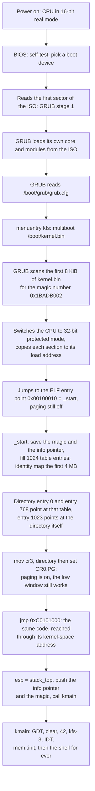

# How kfs-1, kfs-2 and kfs-3 work

Written for a programmer who is comfortable in C, C++, Python or TypeScript and
has never touched assembly, a kernel, or a bootloader. Unfamiliar words are
defined in [GLOSSARY.md](GLOSSARY.md).

Every address, byte value and size below was measured from the artifacts this
repo builds, with `objdump`, `readelf`, `nm` and the QEMU monitor. Nothing here
is idealised. Page-aligned boundaries hold across rebuilds; an address inside
`.text` that is not page aligned moves whenever the kernel is recompiled, and
this file says so where it quotes one.

## 1. The one idea you need first

Every program you have ever written ran **on top of** an operating system.
`printf`, `malloc`, `open`, `Promise`, `import` — all of those are requests to a
kernel. This project is the thing that would have answered them.

So take away everything the OS was doing for you:

| You are used to | Here |
|---|---|
| The loader picks addresses for your code | You write the addresses out by hand, and then the page tables that give them a meaning |
| `main` starts with a working stack | The stack pointer holds garbage until you set it |
| `printf` prints | Nothing prints. There is no console, only a grid of memory the screen happens to read |
| `malloc` gives you memory | `kmalloc` exists now, and it is a file in this repo. Under it there is no OS to ask: the frames come out of a bitmap the kernel fills from GRUB's memory map |
| A segfault kills your process | Nobody kills anything. The kernel names the fault, dumps the machine and halts the processor |
| Threads, files, sockets | None of it exists |

That last row is why the code is still small: there is nothing to call.

## 2. What exists today

Working:

- An assembly entry stub that builds a page directory and one page table with
  no stack at all, switches paging on, jumps to the higher half, sets up a
  stack and calls into Rust.
- **Memory paging**, 4 kb pages only: a page directory, page tables allocated
  on demand, and the recursive directory entry that lets the kernel edit tables
  it never otherwise mapped. It is [PAGING.md](PAGING.md).
- A **higher-half kernel**: the image is linked at virtual `0xC0100000` and
  loaded at physical `0x00100000`, so kernel space is the top gigabyte and the
  low 4 MB stays identity mapped for the GDT, the VGA buffer and GRUB's data.
- **Per-section page rights**: `.text` and `.rodata` are mapped read only, the
  rest of the image read/write, and `CR0.WP` is set so ring 0 obeys the
  read-only bit instead of ignoring it.
- **Kernel and user space** as an address-space fact: `0xC0000000` upwards is
  the kernel's, `0x00400000..0xBFFFFFFF` is user space, and a page mapped with
  the U/S bit outside that range is refused.
- A **physical frame allocator**: one bit per 4 kb frame over the whole 32-bit
  address space, filled from the multiboot memory map, with a `carve` that
  hands back one contiguous run. It is [MEMORY.md](MEMORY.md).
- `kmalloc`, `kfree`, `ksize` and `kbrk` over one contiguous physical block
  carved at boot, so every pointer they return has a fixed physical address.
- `vmalloc`, `vfree`, `vsize` and `vbrk` over frames taken one at a time from
  the bitmap and mapped side by side: virtually contiguous, physically
  scattered. That difference is the point ([MEMORY.md](MEMORY.md)).
- A **32-vector exception table** inside a 256-slot IDT, with assembly stubs
  that capture the whole register state and one Rust function that dispatches
  it.
- **Fatal and recovered kernel panics**: `kpanic!` prints in red, dumps the
  machine and halts the processor; `koops!` prints in yellow, counts and
  returns. A page fault in the user demand zone is recovered by mapping a page
  and retrying the instruction. It is [PANIC.md](PANIC.md).
- A `no_std` Rust kernel whose entry point is `kmain`, plus the panic handler
  the language demands, which now routes into the fatal path.
- The kernel's **own** Global Descriptor Table, installed before anything else
  runs: seven descriptors copied to physical `0x800`, and all six segment
  registers reloaded out of them. `cs` needs a far return, because no `mov`
  may write it. The layout, the install sequence and the proof are
  [GDT.md](GDT.md).
- A VGA text driver — clear, print, colours, a tracked cursor with line
  wrapping and scrolling, the blinking hardware cursor parked after our
  output — and `kmain` using it to display "42" and a green "kfs-3". The
  screen model and the module are [VGA.md](VGA.md).
- The start of a kernel library: C-string helpers, number-to-text conversion
  and a text-to-number parser. The displayed "42" and the `virt` command both
  go through it.
- `printk!` — `core`'s whole formatting engine hooked onto the screen through
  one trait impl. Panics print themselves in red instead of silently freezing
  the machine.
- A polled PS/2 keyboard driver, Shift, Enter and Backspace included, and one
  module, `port.rs`, holding the `in` and `out` instructions its three callers
  share.
- Three virtual screens, switched with F1/F2/F3, each keeping its own
  contents, cursor and colour while off-screen.
- A debug shell behind a `kfs> ` prompt: a line editor over the keyboard
  driver, and fourteen commands in a table. Eight are new in kfs-3 and take
  arguments: `mem`, `space`, `pages`, `virt`, `alloc`, `user`, `fault` and
  `panic`, beside `stack`, `gdt`, `clear`, `reboot`, `halt` and `help`. It is
  [SHELL.md](SHELL.md).
- A hex dump of the live kernel stack, printed on demand from the real `esp`
  up to `stack_top`, 16 bytes to a row with an ASCII column beside them. It is
  [STACK.md](STACK.md).
- A custom compilation target: 32-bit x86, no floating-point hardware, no OS
  underneath.
- A linker script in two parts: a `.boot` section whose load address and
  virtual address are both 1 MiB, and the rest of the kernel at `0xC0101000`
  with `AT()` giving each output section its physical load address.
- A bootable GRUB ISO, 2 752 512 bytes (the subject's limit is 10 MB).
- `make check`, thirty-six assertions made from outside the guest through the
  QEMU monitor: the segment registers, the descriptor bytes at `0x800`, `CR0`
  and `CR3`, the emulator's own view of the page tables, the text in the VGA
  buffer, every new command, and three fatal panics that each have to leave the
  processor halted.

Deliberately absent:

- **Interrupts are never enabled.** `sti` appears nowhere in the tree. The IDT
  exists because a page fault with no handler triple-faults, and "print, stop
  the kernel" is exactly what a triple fault does not do. Hardware interrupts,
  the PIC remap that has to come with them, and the event-driven keyboard that
  follows belong to kfs-4.
- **The PIC is not remapped.** The two 8259 controllers are still where the
  BIOS left them, with the first eight IRQs overlapping the CPU's own
  exception vectors. Remapping them without an interrupt handler to catch the
  result would buy nothing. kfs-4.
- **Nothing runs in ring 3.** The user code, data and stack descriptors are in
  the GDT, user *pages* are real and the `user` command exercises them, but no
  instruction has yet executed at privilege level 3. Leaving ring 0 needs a
  way back in, which needs interrupts first.
- **No processes, no scheduler.** There is one thread of control: `kmain`, then
  the shell's poll loop for ever. A later KFS owns tasks and switching.
- **No swapping, no page cache, no serial port.** A page is either backed by a
  frame or absent; nothing is ever evicted to a disk this kernel cannot talk
  to. Later still.

## 3. Power-on to `kmain`

A **bootloader** is a small program whose only job is to find a kernel, load it
into memory, and jump to it. We use GRUB, the standard Linux one, because
writing your own means talking to disk controllers in 16-bit mode.



Four links in that chain are ours: the magic number GRUB looks for, the
`grub.cfg` line naming our binary, `_start`, and the `higher_half` label it
jumps to. Everything before them is firmware and GRUB doing their ordinary
jobs.

### The handshake with GRUB

GRUB will not load an arbitrary file. It follows a published contract called
**multiboot**: put a recognisable 12-byte header near the front of your binary
and any compliant bootloader will load you and hand over a CPU already in
32-bit mode. Find the header, load and jump. Miss it, refuse the file. That is
the whole agreement, and our half of it is one 97-byte section of
`boot/boot.asm`.

GRUB also leaves two values behind: `0x2BADB002` in `eax`, to say that a
multiboot loader really did the loading, and a pointer in `ebx` to a structure
describing the machine. kfs-1 and kfs-2 threw both away. kfs-3 needs the
memory map inside that structure, so the stub saves the two registers before it
touches anything and passes them to `kmain` as ordinary C arguments.

### Why the stub has no stack yet

GRUB jumps to `_start` with interrupts off and the stack pointer register `esp`
holding **whatever was left in it** — an address that means nothing.

A function call pushes its return address onto the stack. That is true in C, in
Rust, in every compiled language. So calling *anything* before `esp` points at
real memory writes a return address into a random location and corrupts it.

And you cannot fix this in Rust, because Rust code needs a working stack in
order to run at all. "The stack does not exist yet" is not a state Rust can
express. That single problem is the entire reason there is an assembly file in
this repo.

kfs-3 makes the constraint sharper. The stack this kernel wants is at
`0xC0114000`, and that address means nothing until paging is on. So the stub
builds the page tables with no stack: registers only, one `loop`, no `push`, no
`call`. `esp` is set on the first instruction after the jump to the higher
half, and the first `call` in the whole kernel is the `call kmain` two
instructions later.

### Why paging comes before `kmain`

Every address in the compiled Rust kernel is a kernel-space address: `0xC01…`
for code, `0xC010e000` for the boot page directory, `0xC0114000` for the top of
the stack. None of them resolve to anything while paging is off. So the stub
cannot call one line of Rust before `CR0.PG` is set.

That is also why the stub maps the first 4 MB **twice**: once identity, at
linear `0x00000000`, and once at linear `0xC0000000`. The instruction that sets
`CR0.PG` is itself running at a low address, and the instruction after it has
to be fetched from somewhere. With the low window in place, that fetch still
works, and the jump to `0xC0101000` moves execution into kernel space at a
moment of our choosing rather than in the middle of a `mov`.

The low window then stays for good, because the GDT lives at physical `0x800`
and `lgdt` takes a *linear* address ([GDT.md](GDT.md)). The whole layout is
[PAGING.md](PAGING.md).

## 4. The files that are the project

Everything else is documentation or build plumbing.

### `boot/boot.asm` — the entry stub

Assembly is one CPU instruction per line and no abstractions at all. In kfs-1
and kfs-2 this file was fourteen bytes of code: set `esp`, call Rust. kfs-3
makes it the only place where paging can be switched on, so it grew to four
pieces:

| Piece | Where it lands | What it is |
|---|---|---|
| the multiboot header | `.boot`, `0x00100000`, 12 B | magic, flags, checksum |
| `_start` | `.boot`, `0x00100010`, 81 B | build the boot tables, load `CR3`, set `CR0.PG`, jump high |
| `higher_half` | `.text`, `0xC0101000` | set `esp` and `ebp`, push the two arguments, `call kmain`, hang loop |
| the tables and the stack | `.bss`, 24 KiB | page directory (4 KiB), low page table (4 KiB), kernel stack (16 KiB) |

The linker merges the header and `_start` into one output section, `.boot`, 97
bytes long: 12 bytes of header, 4 bytes of padding to the 16-byte alignment
`_start` asks for, then the 81 bytes of code between `0x00100010` and
`boot_end` at `0x00100061`.

**The header** is three 32-bit numbers:

```nasm
MAGIC    equ 0x1BADB002          ; fixed value the spec mandates
FLAGS    equ MBALIGN | MEMINFO   ; 1<<0 | 1<<1 = 3
CHECKSUM equ -(MAGIC + FLAGS)    ; = 0xE4524FFB
```

The validity test is one line of arithmetic: the three must add up to zero in
32-bit maths. `0x1BADB002 + 3 + 0xE4524FFB = 0x100000000`, which overflows to
0. Here it is in the finished binary:

```
Contents of section .boot:
 100000 02b0ad1b 03000000 fb4f52e4
```

x86 stores numbers least-significant byte first, so those bytes read back as
`0x1BADB002`, `0x00000003`, `0xE4524FFB`. The build also checks this
independently with `grub-file --is-x86-multiboot build/kernel.bin`.

The two flags ask GRUB to page-align any modules it loads and to pass us a map
of physical memory. kfs-1 and kfs-2 asked for that map and ignored it.
`kernel/src/multiboot.rs` reads it now, and it is where the "130 559 kb usable
in 2 regions" on the boot screen comes from.

**The tables and the stack** are 24 KiB of `.bss`, every end of them exported:

```nasm
section .bss
alignb 4096
global boot_directory
boot_directory:
    resb 4096
global boot_low_table
boot_low_table:
    resb 4096
alignb 16
global stack_bottom
stack_bottom:
    resb 16384
global stack_top
stack_top:
```

`resb` means "reserve these bytes, do not store them in the file" — `.bss` is
memory the loader is told to hand over as zeros. Closer to `calloc` than to a
literal array of zeros compiled into the binary. Two 4 KiB tables that start
out full of zeros are exactly what a page directory and a page table want: a
zero entry has its Present bit clear, which is "no page here". x86 stacks grow
*downwards*, so the starting `esp` is `stack_top`, the **higher** address.

Because these four symbols live in `.bss`, the linker gives them kernel-space
addresses: `nm` reports `boot_directory` at `0xC010E000` and `stack_top` at
`0xC0114000`. The stub runs before paging, so it cannot use those values. It
subtracts `0xC0000000` from each one at assembly time, which is what
`boot_low_table - KERNEL_SPACE` means in the source and what the disassembly
below shows as the literal `0x10f000`.

**`_start`**, disassembled from the real binary:

```
00100010 <_start>:
  100010: 89 c6              mov  %eax,%esi          ; save the multiboot magic
  100012: 89 df              mov  %ebx,%edi          ; save the info pointer
  100014: ba 00 f0 10 00     mov  $0x10f000,%edx     ; boot_low_table, physical
  100019: b8 03 00 00 00     mov  $0x3,%eax          ; present|writable, frame 0
  10001e: b9 00 04 00 00     mov  $0x400,%ecx        ; 1024 entries

00100023 <_start.identity>:
  100023: 89 02              mov  %eax,(%edx)        ; write one table entry
  100025: 05 00 10 00 00     add  $0x1000,%eax       ; next 4 kb frame
  10002a: 83 c2 04           add  $0x4,%edx          ; next entry
  10002d: e2 f4              loop 100023             ; ecx times

  10002f: ba 00 e0 10 00     mov  $0x10e000,%edx     ; boot_directory, physical
  100034: b8 03 f0 10 00     mov  $0x10f003,%eax     ; the table, present|write
  100039: 89 02              mov  %eax,(%edx)        ; entry 0:    0x00000000
  10003b: 89 82 00 0c 00 00  mov  %eax,0xc00(%edx)   ; entry 768:  0xC0000000
  100041: b8 03 e0 10 00     mov  $0x10e003,%eax     ; the directory itself
  100046: 89 82 fc 0f 00 00  mov  %eax,0xffc(%edx)   ; entry 1023: 0xFFC00000
  10004c: 0f 22 da           mov  %edx,%cr3          ; the CPU knows the table
  10004f: 0f 20 c0           mov  %cr0,%eax
  100052: 0d 00 00 00 80     or   $0x80000000,%eax   ; CR0.PG
  100057: 0f 22 c0           mov  %eax,%cr0          ; paging is on from here
  10005a: b8 00 10 10 c0     mov  $0xc0101000,%eax
  10005f: ff e0              jmp  *%eax              ; into kernel space
```

Three of those numbers are worth reading twice. `0xc00` is `768 * 4`: entry 768
of the directory covers linear `0xC0000000`, because each directory entry spans
4 MB. `0xffc` is `1023 * 4`, the last entry, and it is filled with the
directory's own address, which is what makes every live page table reachable
later ([PAGING.md](PAGING.md)). And the `loop` writes frame numbers `0x0000`,
`0x1000`, `0x2000` … so table entry *n* points at physical frame *n*: an
identity map of the first 4 MB, built in twelve bytes of code.

The other side of the jump:

```
c0101000 <kernel_start>:
  c0101000: bc 00 40 11 c0   mov  $0xc0114000,%esp   ; stack_top
  c0101005: 89 e5            mov  %esp,%ebp
  c0101007: 57               push %edi               ; the info pointer
  c0101008: 56               push %esi               ; the magic
  c0101009: e8 62 68 00 00   call c0107870 <kmain>

c010100e <higher_half.hang>:
  c010100e: fa               cli
  c010100f: f4               hlt
  c0101010: eb fc            jmp  c010100e
```

`kmain`'s address, `0xC0107870` in this build, moves whenever the kernel is
recompiled; `0xC0101000` and `0xC0114000` do not, because the linker script
page-aligns both. The two pushes are in reverse order because the 32-bit C
calling convention takes arguments right to left, so `kmain(magic, info)` reads
`esi` first. The hang loop below the `call` is unreachable while `kmain` never
returns, but it is the right thing to have there: `cli` switches interrupts
off, `hlt` stops the CPU until one arrives anyway, and the `jmp` re-halts if
something wakes it. Halting is not spinning — `hlt` lets a physical CPU idle
instead of burning a core at 100%.

**The entry point has to stay at its load address.** GRUB reads the ELF entry
point and jumps to it with paging off, so that address must be a physical one.
The first attempt at this kernel put `_start` in `.text` with everything else,
which gave it the entry point `0xC0101000`; disassembling the result showed
GRUB would have jumped into unmapped memory and triple-faulted before executing
one instruction. The fix is the `.boot` output section in `linker.ld`, whose
virtual address and load address are both `0x00100000`.

The trailing `.note.GNU-stack` line is an empty marker section. Without it,
modern `ld` warns that the stack might be executable. Cosmetic, two lines,
silent build.

### `kernel/src/lib.rs` — the kernel

```rust
#![no_std]

use core::panic::PanicInfo;

mod gdt;
mod heap;
mod idt;
mod keyboard;
mod klib;
mod mem;
mod multiboot;
mod paging;
mod panic;
mod pmm;
mod port;
mod printk;
mod shell;
mod stack;
mod vga;

use printk::printk;

#[no_mangle]
pub extern "C" fn kmain(magic: u32, info: u32) -> ! {
    unsafe { gdt::install() };
    vga::clear();
    let mut buf = [0u8; 10];
    vga::print(klib::utoa(42, &mut buf));
    vga::print("\n");
    vga::set_color(vga::Color::BrightGreen, vga::Color::Black);
    printk!("kfs-{}\n", 3);
    vga::set_color(vga::Color::White, vga::Color::Black);
    idt::install();
    mem::init(magic, info);
    shell::run()
}

#[panic_handler]
fn on_panic(info: &PanicInfo) -> ! {
    panic::fatal(core::format_args!("{}", info))
}
```

Read against what you already know:

| Written here | What it means |
|---|---|
| `#![no_std]` | Drop Rust's standard library; it assumes an OS. Keep `core`: integers, slices, `Option`, no I/O, no heap. In C terms: `-ffreestanding`, no libc. |
| `#[no_mangle]` | `extern "C"` in C++. Keep the symbol named literally `kmain`, because the assembly file wrote `call kmain`. |
| `extern "C"` | Use the C calling convention, so assembly and Rust agree on what a call looks like — including that the two pushed values arrive as `magic` and `info`. |
| `-> !` | "Never returns." A promise to the compiler, and the reason the body has to end in something that never returns either, here `shell::run()`. |
| `#[panic_handler]` | Mandatory without `std`. A panic normally aborts the *process*; there are no processes. You must say where panics go. Ours goes to the fatal path and halts the processor. |

The order of those seven statements is the whole design of the boot sequence,
and every line of it is forced:

1. `gdt::install()` comes first because multiboot warns that the GDTR may be
   invalid on entry, and that the kernel must not load a segment register, not
   even with the same value, until it owns a table of its own
   ([GDT.md](GDT.md)).
2. `vga::clear()` and the banner come next because everything after them can
   fail, and a failure you cannot read is a failure you cannot fix.
3. `idt::install()` comes before any memory work. `mem::init` sets `CR0.WP`
   and rewrites the live page tables; a mistake there is a page fault, and a
   page fault with no IDT is a triple fault and a silent reboot
   ([PANIC.md](PANIC.md)).
4. `mem::init(magic, info)` is the only consumer of the two arguments the stub
   pushed. It can refuse to continue — a bad magic value or an unusable
   memory map is a `kpanic!` — and by this point a panic can print itself.
5. `shell::run()` never returns.

The panic handler forwards to `panic::fatal`, so a Rust `panic!`, an
`unwrap()` on `None` and an explicit `kpanic!` all produce the same report:
the message in bright red, `CR0`, `CR2`, `CR3`, the recovered-oops count, 64
bytes of live stack, then `cli; hlt`. Two things worth knowing about it:

- Printing from a panic reuses the very driver the panicking code may have
  been in the middle of. That is acceptable precisely because a panic is
  terminal: nothing runs afterwards, so corrupt-looking output is a cosmetic
  risk, not a correctness one.
- It is in the shipped binary. In kfs-1 it was not: link-time optimisation
  proved no code path could actually panic, so the handler and all of
  `core::fmt` behind it were dead code and were dropped. That was measured by
  temporarily panicking in `kmain`, which grew `kernel.bin` from 2 016 to
  7 044 bytes. The shell ended that: `dispatch` formats a runtime string and
  the line buffer is indexed at run time, so a panic is reachable again.

`core::hint::spin_loop()` emits the x86 `pause` instruction — a hint that a
loop is waiting on something, which saves power and avoids a pipeline penalty.
It is where the kernel spends all of its time: the shell's line editor asks the
keyboard for a key and pauses when there is none. That is why `tools/check.sh`
finds `EIP` inside `0xC0100000..0xC0200000` whenever it samples the guest. The
fatal path does not `pause`; it runs `cli` then `hlt` in a loop, which is what
lets the check assert `HLT=1` from outside.

### `kernel/src/multiboot.rs` — what GRUB left behind

`ebx` pointed at a structure whose first field is a bitmask saying which of the
other fields GRUB bothered to fill in. This module checks the magic value in
`eax`, checks that the pointer is inside the low identity window, then walks
the memory map: a chain of variable-length entries, each with a 64-bit base and
length and a type, of which only type 1 means "usable RAM".

Two details make it safe. The entries are packed and can land on any address,
so every field is read with `read_unaligned`; and this kernel has 32-bit
pointers, so regions are clamped to 32 bits and dropped if they start above
4 GB. If the map is missing, the older `mem_lower`/`mem_upper` pair is used
instead, and if both are missing `mem::init` panics rather than guessing.

### `kernel/src/mem.rs` — the layout, in one place

Every address landmark in the kernel is a constant in this file:
`KERNEL_SPACE`, `USER_BASE`, `DEMAND_BASE`, `KHEAP_BASE`, `VMALLOC_BASE`,
`TABLE_WINDOW`. It also holds the `LAYOUT` table the `space` command prints,
the `Space` enum that answers "is this address kernel or user", and the
`extern` block that reads the section symbols the linker script exports.

`mem::init` is the boot sequence for memory, in order: probe RAM through
`multiboot`, fill the frame bitmap, reserve the low megabyte and the kernel
image, install the real page tables, carve the physical block for `kmalloc`,
attach the two heaps, print the two summary lines. Anything that cannot be
done panics. The layout is [PAGING.md](PAGING.md); the allocators are
[MEMORY.md](MEMORY.md).

### `kernel/src/pmm.rs` — one bit per frame

The physical memory manager owns a 128 KB static array in `.bss`: one bit for
each of the 2²⁰ 4 kb frames in a 32-bit address space, where a set bit means
free. Zero-initialised means "nothing is free", so the map costs nothing in the
ISO and needs no allocator to bootstrap itself.

`init` sets the bits the multiboot map calls usable, `reserve` clears the ones
the BIOS and the kernel image occupy, and `alloc_frame`, `alloc_range`,
`free_frame` and `carve` hand frames out and take them back. `carve` is the odd
one: it removes one contiguous run from the map for ever, which is what makes
`kmalloc` physically contiguous ([MEMORY.md](MEMORY.md)).

### `kernel/src/paging.rs` — the page tables

The entry format, the nine flag bits, the static table that covers the kernel
window, and the code that reads and writes both levels: `get_page(addr,
create)`, `map_page`, `map_new`, `unmap_page`, `protect`, `translate`,
`invalidate` and `flush`. `init` is what sets the per-section rights and
`CR0.WP`, so from that instruction on the kernel cannot write its own code.

It also holds the fault decision — `handle_fault` returns true only for an
absent page inside the demand zone — and the printing the `pages`, `virt` and
`panic` paths use. Read [PAGING.md](PAGING.md).

### `kernel/src/heap.rs` — two heaps, one type

One `Heap` type over a virtual region, parameterised by a `Backing` that is
either `Contiguous` (a carved physical block) or `Scattered` (a frame at a
time from the bitmap). Blocks carry an 8-byte header holding a size and a used
flag; allocation is first fit with splitting, freeing coalesces forward, and
the region grows and shrinks in whole pages.

Two statics of that type produce the eight public functions the subject asks
for: `kmalloc`, `kfree`, `ksize`, `kbrk` on the contiguous heap at
`0xD0000000`, and `vmalloc`, `vfree`, `vsize`, `vbrk` on the scattered one at
`0xE0000000`. `brk` follows `sbrk` semantics and returns the *old* break. Read
[MEMORY.md](MEMORY.md).

### `kernel/src/idt.rs` — 32 gates and a dispatcher

A 256-slot Interrupt Descriptor Table, of which the first 32 are filled with
interrupt gates (type byte `0x8E`, selector `0x08`, the kernel code segment
from the GDT). The stubs are written in assembly through `global_asm!`, because
a fault arrives with a frame the compiler knows nothing about: two macros
generate one stub per vector, pushing a zero where the CPU pushed no error
code, and all of them jump to `isr_common`, which runs `pusha`, pushes `esp`
and calls into Rust.

`fault_entry` is that Rust function. It receives a pointer to the captured
frame, gives a page fault one chance at recovery, and otherwise hands the frame
to the fatal reporter. Interrupts are never enabled, so nothing but a CPU
exception ever reaches this table ([PANIC.md](PANIC.md)).

### `kernel/src/panic.rs` — two severities

`kpanic!` and `koops!` are the two macros, and the difference between them is
the whole of the subject's "all panics are not fatal". `oops` prints in yellow,
increments a counter and returns to the caller. `fatal` prints in bright red,
dumps `CR0`, `CR2`, `CR3`, the oops count and 64 bytes of stack, and ends in
`stop()`: `cli` then `hlt` in a loop.

`fatal_fault` is the third entry point, used only from `fault_entry`, and it
adds the register frame and one plain-language line about the fault — which
address, whether a read or a write, user or kernel, and whether the page was
absent or present with the wrong rights. Read [PANIC.md](PANIC.md).

### `kernel/src/klib.rs` — the start of a kernel library

The subject asks for "basic functions (strlen, strcmp, ...)" because a kernel
has no libc. In Rust most of that shelf already exists: `core` provides
`str::len` and slice comparison, and the build's `compiler-builtins-mem`
feature provides `memcpy`/`memset`/`memcmp`. What is genuinely missing are the
C-shaped pieces, so that is what `klib` holds:

- `strlen` / `strcmp` over NUL-terminated C strings. Still no caller, and
  marked `#[allow(dead_code)]` to say so out loud: the multiboot data this
  kernel actually reads is the memory map, which is binary, not text. They are
  `unsafe fn` because a raw pointer walk cannot be checked by the compiler.
- `utoa` — render a `u32` in decimal into a caller-provided buffer, no heap,
  no `core::fmt`. This one is live: `kmain` prints "42" by actually computing
  `utoa(42, &mut buf)`.
- `parse_u32` — the other direction, and new in kfs-3, because commands now
  take arguments. `0x` selects base 16, anything else is decimal, and every
  multiply and add is checked, so `virt 0xffffffffff` returns `None` instead of
  wrapping into a plausible-looking address.

The punchline is what the optimiser did with `utoa`: it is a pure function of a
constant, so LLVM evaluated the whole digit loop at compile time — at the
commit introducing it, the linked binary came out byte-for-byte identical to
the literal-string version. The helper is real, exercised on the mandatory
path, and free.

### `kernel/src/printk.rs` — printf without an OS

`core` cannot print — but it ships the complete formatting engine, held back
by one missing piece: somewhere for the text to go. The contract is
`core::fmt::Write`: implement a single method, `write_str`, and the trait
hands you `write_fmt` and with it every `{}`, `{:x}`, width and padding rule
Rust has. `vga::Writer` is that implementation (three lines: forward to
`vga::print`), and `printk!` wraps `core::format_args!` the way `println!`
does in userland. No allocation anywhere: `format_args!` compiles the format
string into a series of `write_str` calls at compile time.

This is the classic Rust-kernel move — the standard library's I/O is gone,
but the *language-level* machinery (traits, `format_args!`) never depended on
an OS in the first place. It is also why the panic path can take
`core::fmt::Arguments` and print a formatted message without a heap
([PANIC.md](PANIC.md)).

### `kernel/src/keyboard.rs` — asking the keyboard instead of listening

The PS/2 keyboard does not send characters. Its 8042 controller (status port
`0x64`, data port `0x60`) delivers **scancodes** — numbers naming physical key
positions, press and release separately — and turning those into ASCII against
a layout table is the driver's whole job. Shift is just two more scancodes
whose press/release toggles a flag; F1-F3 come back as "switch screen"
commands rather than characters.

Polled, not interrupt-driven, and still polled in kfs-3. The IDT exists now,
but it holds CPU exceptions only: no `sti`, no PIC remap, so the keyboard has
no way to interrupt anything. The shell's line editor asks "anything for me?"
(status bit 0 on port `0x64`) on every lap of its loop. Polling burns the CPU
politely (`pause`) and loses nothing at human typing speed. Making it
event-driven is kfs-4's job. The `in` instruction it needs comes from
`kernel/src/port.rs`.

### `kernel/src/vga.rs` — the screen driver

The screen is not a device you ask politely: it is 4 000 bytes of memory that
the display hardware repaints from sixty times a second. The module writes u16
cells (colour byte + ASCII byte) into it through `core::ptr::write_volatile` —
`volatile` because these stores are never read back, and a store whose result
is unused is exactly what an optimiser deletes. Public entry points —
`clear()`, `set_color(fg, bg)`, `print(&str)`, `put_char(u8)`, `backspace()`,
`switch_screen(n)` — over a tracked write position: `\n`, wrapping at column
80, scrolling at the bottom row, and the blinking hardware cursor re-parked
after each print through the CRT controller's I/O ports (`outb`, from
`kernel/src/port.rs`). Three virtual screens live behind it: the active one
exists only in the real buffer; switching copies the live 4 000 bytes into the
leaving screen's save slot and the entering screen's slot back — contents,
cursor and colour all travel.

One address changed in kfs-3. The buffer used to be `0xB8000`, the physical
address. It is `0xC00B8000` now, the same 4 000 bytes seen through the kernel
window, because the whole first 4 MB of RAM is mapped at `0xC0000000`
([PAGING.md](PAGING.md)). The identity window still works, so `0xB8000` would
too; using the kernel-space alias keeps every pointer in the Rust half of the
kernel inside kernel space. The full story — the cell format, why `volatile`,
the port I/O, the `.bss` trick that keeps 12 KiB of screen slots out of the
binary — is [VGA.md](VGA.md).

### `kernel/src/port.rs`: the other address space

Two functions, `inb` and `outb`, wrapping the x86 `in` and `out`
instructions. Devices on a PC answer at two kinds of address: memory-mapped
ones like the VGA text buffer live in ordinary RAM addresses, and the rest
live in a separate 65 536-slot space nothing but `in` and `out` can reach. The
CRT controller (`0x3D4`/`0x3D5`), the 8042 keyboard controller (`0x60`/`0x64`)
and the CPU reset line are all in that second space. `vga.rs` and
`keyboard.rs` each held a private copy of those two instructions and both gave
it up when `shell.rs` became the third caller: three copies of one `asm!` line
is the point where a shared module stops being ceremony.

### `kernel/src/gdt.rs`: the kernel's own segment table

x86 resolves every memory access through a segment descriptor, and until kfs-2
those descriptors were GRUB's. This module builds seven of its own (null,
kernel code/data/stack, user code/data/stack), copies them to physical
`0x800`, points the CPU at them with `lgdt`, and reloads all six segment
registers out of the new table. Every segment is flat (base 0, limit 4 GiB),
so the swap is invisible to every address already in flight, which is exactly
what makes it safe to perform while running. `cs` is the awkward one: no `mov`
may write it, so the code pushes a selector and a return address and runs
`retf`.

Paging does not replace this and does not move it. Segmentation runs first and
produces a linear address; paging turns that linear address into a physical
one. Because every descriptor here has base 0, the two stages compose to
"linear equals the address you wrote", which is why the low identity window
must survive: `lgdt` was given the linear address `0x800`, and it has to keep
meaning physical `0x800` after paging starts. The descriptor layout bit by bit,
why the table is copied instead of linked, and what happens if you skip the far
return: [GDT.md](GDT.md).

### `kernel/src/stack.rs`: a hex dump of the live stack

`esp()` reads the stack pointer in the *caller's* frame, `snapshot()` copies
bytes upward from there towards `stack_top`, and `print()` renders them 16 to
a row with an ASCII column beside the hex. Two attributes carry the module.
`esp()` is `#[inline(always)]`, because a real call would push a return
address first and so describe the wrong frame. `print()` is
`#[inline(never)]`, because its copy buffer has to sit *below* the captured
`esp`, and it only does while the function owns a frame of its own: inlined
once, every read past the start of the buffer returned a byte the copy had
already written, and the dump came out periodic with a 64-byte period, a
failure that looks exactly like real stack content.

kfs-3 gave it a second caller. The fatal panic path prints a 64-byte window of
the same stack, after checking that `esp` is inside the real bounds, which is
why the `KERNEL PANIC` reports on screen end in a short hex dump
([PANIC.md](PANIC.md)). The window, the copy, the row format and the reason
there is no frame-pointer backtrace: [STACK.md](STACK.md).

### `kernel/src/shell.rs`: a prompt and fourteen commands

Not a POSIX shell: a prompt, a line, and a name looked up in a table. `CMDS`
is a table rather than a `match`, so `help` is a loop over the same rows the
dispatcher searches and a command cannot exist without its own help line. That
is the same choice as the scancode tables in `keyboard.rs` and the palette in
`vga.rs`.

kfs-3 changed the row type from `fn()` to `fn(&str)`, so the dispatcher splits
the line at the first space and hands the rest to the command. That is what
lets `virt 0xc0101000`, `fault ro` and `panic oops` exist without a second
parser. Eight commands are new — `mem`, `space`, `pages`, `virt`, `alloc`,
`user`, `fault`, `panic` — and each of them exists so that a memory subsystem
you cannot see becomes a memory subsystem you can ask questions of, at a moment
you choose, from the keyboard. The line editor, every command, and how
`tools/check.sh` drives the whole thing from outside the guest:
[SHELL.md](SHELL.md).

### `linker.ld` — where the code lands in RAM

Normally the compiler, the linker's default script and the OS loader agree on
addresses without asking you. Here none of them exist, so you write it out:

```ld
ENTRY(_start)

KERNEL_SPACE = 0xC0000000;
KERNEL_LOAD  = 0x00100000;

SECTIONS
{
    . = KERNEL_LOAD;
    boot_start = .;
    .boot ALIGN(4K) : { KEEP(*(.multiboot)) *(.boot) }
    boot_end = .;

    . += KERNEL_SPACE;
    . = ALIGN(4K);
    kernel_start = .;

    .text : AT(ADDR(.text) - KERNEL_SPACE) { *(.text*) }
    kernel_code_end = .;

    .rodata ALIGN(4K) : AT(ADDR(.rodata) - KERNEL_SPACE) { *(.rodata*) }
    kernel_readonly_end = ALIGN(4K);

    .data ALIGN(4K) : AT(ADDR(.data) - KERNEL_SPACE) { *(.data*) *(.got*) }
    .bss  ALIGN(4K) : AT(ADDR(.bss)  - KERNEL_SPACE) { *(COMMON) *(.bss*) }
    kernel_end = ALIGN(4K);

    /DISCARD/ : { *(.eh_frame*) *(.comment) }
}
```

`.` is the location counter: the address currently being handed out. Five
decisions matter in those few lines.

**Two parts, not one.** The script hands out addresses starting at 1 MiB, emits
`.boot`, then adds `0xC0000000` to the counter and emits everything else. So
the file describes one program at two addresses: a 97-byte prologue at
`0x00100000` and a kernel at `0xC0101000`.

**`AT()` is the load address.** Every output section has two addresses. The
**VMA** is what the code is compiled to use, what appears in `nm` and in a
disassembly, and what has to be mapped for the code to run. The **LMA** is
where the loader puts the bytes. Normally they are the same and nobody thinks
about it. Here `AT(ADDR(.text) - KERNEL_SPACE)` says: this section's code
believes it lives at `0xC0101000`, but GRUB must write it to physical
`0x00101000`, because paging is off while GRUB runs and there is no way to
write to `0xC0101000` yet. `readelf` shows the pair directly:

```
LOAD  Offset 0x0000a0  VirtAddr 0x00100000  PhysAddr 0x00100000  FileSiz 0x00061  MemSiz 0x00061  R E
LOAD  Offset 0x001000  VirtAddr 0xc0101000  PhysAddr 0x00101000  FileSiz 0x0c56c  MemSiz 0x38001  RWE
```

The first row is the stub: VMA equals LMA, which is what lets GRUB jump
straight into it. The second row is the kernel: the two differ by exactly
`0xC0000000`, and closing that gap is all the `_start` stub does.

**`.multiboot` first, and wrapped in `KEEP`.** First, so the header lands
inside the 8 KiB window GRUB scans — and inside `.boot`, so it is not stranded
at a virtual address GRUB cannot read. `KEEP`, because nothing in the program
refers to that header at all, since GRUB finds it by scanning the file, and
`--gc-sections` collects precisely that kind of section. Without `KEEP` the
build still succeeds, the header is gone, and the ISO stops booting.

**Six exported symbols, five of them read back by the kernel.** The linker is
the only thing that knows where the sections ended up, so it publishes the
boundaries and `kernel/src/mem.rs` declares the ones it needs in an `extern`
block:

| Symbol | This build | What reads it |
|---|---|---|
| `boot_start` | `0x00100000` | `mem::load_phys()`: the first physical byte to reserve |
| `boot_end` | `0x00100061` | the end of the stub, 97 bytes on |
| `kernel_start` | `0xC0101000` | the first page to give per-section rights |
| `kernel_code_end` | `0xC010949B` | the end of `.text`, which is not page aligned and so moves whenever the kernel is rebuilt |
| `kernel_readonly_end` | `0xC010D000` | everything below this is mapped read only |
| `kernel_end` | `0xC013A000` | the last physical page to reserve from the frame allocator |

`paging::init` walks the kernel window one page at a time and marks a page read
only when it falls between `kernel_start` and `kernel_readonly_end`. Without
these symbols that loop would need hard-coded addresses that go stale on the
next build ([PAGING.md](PAGING.md)).

**`ALIGN(4K)` everywhere, and `/DISCARD/`.** Page rights have 4 kb granularity,
so a section boundary that is not page aligned means one page with two
purposes: `.rodata` sharing a page with `.data` would make the kernel's
constants writable or its variables read only. `kernel_readonly_end` is
therefore an aligned value rather than the true end of `.rodata`. The discards
are unwind tables, which describe how to walk back out of a panic and this
kernel aborts instead, and `.comment`, which is toolchain version strings.
Neither belongs in a kernel image.

The link command:

```sh
ld -m elf_i386 -n -nostdlib --gc-sections -T linker.ld -o build/kernel.bin \
   build/boot.o kernel/target/i686-kfs/release/libkernel.a
```

`-m elf_i386` asks for 32-bit x86 output, since the host `ld` defaults to
64-bit. `-n` switches off page-alignment of *sections in the file*, keeping the
image small; the alignment the page tables need comes from the `ALIGN(4K)`
directives instead. `-nostdlib` links no host library at all, and the build
checks the result of that promise with `nm -u`. `--gc-sections` drops every
section nothing reaches from `_start`, which is worth a factor of eight here
and is why `.multiboot` needs `KEEP`; the measurement is in the `Makefile`
section below. `-T` supplies our script instead of the host's default.

> The subject forbids reusing the host's linker *script*, not the host's
> linker. `ld` is a tool; `linker.ld` is ours.

### The memory map

There are two of them now, and keeping them apart is most of understanding
paging. The **virtual** map is what every pointer in the kernel means. The
**physical** map is what is actually in the RAM chips. Before kfs-3 they were
the same map.

This is the virtual one, printed by the `space` command from the `LAYOUT`
table in `mem.rs`:

```
 range                  owner   region        contents
 0x00000000..0x003fffff kernel  low window    identity: gdt, vga, kernel image
 0x00400000..0x007fffff user    user space    free for user pages
 0x00800000..0x008fffff user    user demand   paged in by the fault handler
 0x00900000..0xbfffffff user    user space    free for user pages
 0xc0000000..0xc03fffff kernel  kernel image  ram 0..4mb, kernel code read only
 0xd0000000..0xd1ffffff kernel  kernel heap   kmalloc, contiguous physical
 0xe0000000..0xefffffff kernel  vmalloc       vmalloc, scattered frames
 0xffc00000..0xffffffff kernel  page tables   the directory mapped into itself
```

The first row is the compromise this kernel makes. The GDT is at physical
`0x800` and `lgdt` was given that as a *linear* address, so the low window has
to stay ([GDT.md](GDT.md)). It costs user space its first 4 MB, which is why
user space starts at `0x00400000` and not at zero. The last row is the
recursive directory entry, which is what makes page tables editable at all
([PAGING.md](PAGING.md)).

The physical map, on the QEMU default machine the numbers above came from:

| Physical range | Size | What is there |
|---|---|---|
| `0x00000000..0x000FFFFF` | 1 MB | BIOS structures, the GDT at `0x800`, the VGA buffer at `0xB8000`, GRUB's leftovers. Reserved whole, never allocated |
| `0x00100000..0x00100FFF` | 4 kb | the `.boot` section: the multiboot header and `_start` |
| `0x00101000..0x00139FFF` | 228 kb | the kernel image: `.text`, `.rodata`, `.data`, `.bss`, including the boot directory at `0x0010E000`, the boot low table at `0x0010F000`, the kernel-window table at `0x00138000` and the 16 KiB stack |
| `0x0013A000..0x02118FFF` | 32 636 kb | the block carved for `kmalloc`, removed from the frame bitmap for ever |
| `0x02119000` upwards | the rest | free frames: 24 263 of them, handed out one at a time by `pmm::alloc_frame` |

Those last three rows shift with the amount of RAM the machine reports: the
carve asks for a quarter of usable memory, capped at the 32 MB the kmalloc
region can address. On this machine that is 130 559 kb usable in 2 regions,
32 639 frames of 4 kb, and 24 263 of them still free once the reservations are
done.

The ELF sections behind the second and third rows, straight out of
`readelf -S`:

```
  [ 1] .boot     PROGBITS  00100000  off 0000a0  size 000061  AX  align 16
  [ 2] .text     PROGBITS  c0101000  off 001000  size 00849b  AX  align 16
  [ 3] .rodata   PROGBITS  c010a000  off 00a000  size 002952  A   align 4
  [ 4] .data     PROGBITS  c010d000  off 00d000  size 00056c  WA  align 4
  [ 5] .bss      NOBITS    c010e000  off 00d56c  size 02b001  WA  align 4096
```

| Section | Size | Notes |
|---|---|---|
| `.boot` | 97 B | the header, `_start`, and nothing else. `AX`: allocated, executable |
| `.text` | 33 947 B | `higher_half`, the 32 exception stubs, `kmain`, the shell, the drivers, and `core::fmt` |
| `.rodata` | 10 578 B | the two scancode tables, the `LAYOUT` and `CMDS` rows, the `isr_table` of stub addresses, every literal string the shell prints. `A` with no `W`: this is what `CR0.WP` makes real |
| `.data` | 1 388 B | the VGA colour attribute's initial value, the global offset table, compiler leftovers |
| `.bss` | 176 129 B | `NOBITS`: never stored on disk. The 128 KB frame bitmap, the 4 KiB kernel page table, the two boot tables, the 16 KiB stack, the 2 KiB IDT, three 4 KiB screen slots, driver state |

That is 222 139 bytes in memory from a `build/kernel.bin` of 63 748 bytes on
disk: the difference is almost all `.bss`, which the loader must provide as
zeros but never reads from the file. The frame bitmap is the biggest single
item in it, and being zero-filled is not an accident — a zero bit means "not
free", so an untouched bitmap is a correct bitmap that has yet to be told
about any RAM ([MEMORY.md](MEMORY.md)).

Finally, the same map as the emulator sees it, which is the one measurement
nothing inside the kernel can fake. `info mem` on the QEMU monitor walks the
real page tables and prints the ranges it finds, with the rights on each:

```
0-400000          -rw
c0000000-c0101000 -rw
c0101000-c010d000 -r-
c010d000-c0400000 -rw
ffc00000-ffc01000 -rw
fff00000-fff01000 -rw
fffff000-100000000 -rw
```

Row by row: the low identity window; the kernel window up to the image; the
image's `.text` and `.rodata`, read only, which is the `-r-` the check greps
for; the rest of the kernel window; then the three live page tables seen
through the recursive entry — the low table at `0xFFC00000`, the kernel-window
table at `0xFFF00000`, and the directory itself at `0xFFFFF000`.

### `kernel/i686-kfs.json` — inventing a platform

You normally pick a target off a shelf: `x86_64-apple-darwin`,
`i686-unknown-linux-gnu`. Every one of those names an operating system, and
that is a lie here. There is no shelf entry for "32-bit x86, nothing
underneath", so the spec sheet is written by hand:

| Field | Why |
|---|---|
| `"llvm-target": "i686-unknown-none"` | 32-bit x86, no OS |
| `"data-layout"` | type sizes and alignments for i686; must match the LLVM target or codegen is subtly wrong |
| `"arch": "x86"`, `"target-pointer-width": 32` | 32-bit pointers |
| `"cpu": "pentium4"` | the baseline instruction set to compile for |
| `"os": "none"` | no syscalls, no libc assumptions |
| `"panic-strategy": "abort"` | there is no unwinder to unwind into |
| `"features": "-mmx,-sse,+soft-float"` | forbid the vector units, do float maths in software |
| `"rustc-abi": "softfloat"` | consistent with the above: floats travel in integer registers |
| `"disable-redzone": true` | the red zone is 128 bytes below `esp` a function may scribble in without reserving. Legal in userland, fatal here: the exception stubs push a whole register frame at whatever `esp` the fault interrupted, and would silently eat it |
| `"max-atomic-width": 64` | 64-bit atomics work on this CPU via `cmpxchg8b` |
| `"linker-flavor"`, `"linker"` | only used if cargo does the linking. We link ourselves, so these are inert |

The SSE line is the one worth understanding. Floating-point and vector units on
x86 have to be switched on explicitly after boot, by setting bits in CPU
control registers. If the optimiser emitted a single SSE instruction before
that happened, the CPU would raise an exception and — before kfs-3 — find no
handler installed and triple-fault. There is a handler now, so the same
mistake would produce a `KERNEL PANIC` naming vector 7 instead of a reboot,
which is better but still fatal. Banning an instruction set we do not use is
cheaper than initialising hardware we do not need.

Worth noticing what the file does *not* say: there is no `frame-pointer`
setting, so rustc omits the frame pointer wherever it can and `ebp` is an
ordinary register in this kernel. That is why the `stack` command prints bytes
and not a backtrace: a walk through `[ebp]` would print structured-looking
nonsense ([STACK.md](STACK.md)).

Because no prebuilt standard library exists for a target we just invented,
`kernel/.cargo/config.toml` rebuilds one from source:

```toml
[build]
target = "i686-kfs.json"

[unstable]
json-target-spec = true
build-std = ["core", "compiler_builtins"]
build-std-features = ["compiler-builtins-mem"]
```

`build-std` compiles `core` and `compiler_builtins` for our target.
`compiler-builtins-mem` supplies `memcpy`, `memset` and `memcmp` in Rust: LLVM
emits calls to those names for struct copies and slice operations, and on a
normal system libc provides them. We have no libc. `json-target-spec` is what
permits `.json` target files on current nightly at all, and nightly itself is
required because rebuilding `core` is an unstable feature — pinned in
`rust-toolchain.toml` so `rustup` handles it without manual juggling.

`Cargo.toml` asks for `lto = true` with a single codegen unit: whole-program
link-time optimisation across `core` and our own code. In kfs-1 that was
enough to prove `core::fmt` unreachable and drop it entirely, measured when
`printk` landed: 2 KB to 430 KB without LTO, back to 2 KB with it. The shell
formats runtime values, so that machinery stays in the binary now, and what
LTO buys is inlining and dead-code removal inside what is left. And
`Cargo.toml` asks for `crate-type = ["staticlib"]`, so cargo produces
`libkernel.a` instead of an executable: a bag of parts for our own `ld`
invocation to assemble, rather than a finished program linked with the wrong
script. `panic = "abort"` in both profiles strips the unwinding machinery,
which would otherwise want a runtime we do not have.

### `grub.cfg` — the boot menu

```
set timeout=0
set default=0
menuentry "kfs" {
    multiboot /boot/kernel.bin
    boot
}
```

`timeout=0` boots straight through with no menu. `multiboot` is the GRUB
command that loads a multiboot-1 kernel: it validates the header, copies each
program header to its *physical* load address and enters 32-bit protected mode.
`boot` transfers control. The path is inside the ISO, not on your machine —
`make` stages `build/iso/boot/kernel.bin` and `build/iso/boot/grub/grub.cfg`
before calling `grub-mkrescue`.

### `Makefile` — four artifacts in order

```
boot/boot.asm ──nasm -f elf32──────────────► build/boot.o        (1 520 B)
kernel/src/*  ──cargo build --release──────► libkernel.a
both          ──ld --gc-sections -T ...────► build/kernel.bin    (63 748 B)
kernel.bin    ──grub-mkrescue──────────────► kfs.iso             (2 752 512 B)
```

A 63 KB kernel still produces a 2.7 MB image, because `grub-mkrescue` copies
GRUB itself and its module tree onto the ISO. The three empty flags
`--fonts= --locales= --themes=` are what holds it to that: Fedora's GRUB data
directory carries a 2.4 MiB Unicode font and several megabytes of
translations, and one English `menuentry` needs none of them.

**`--gc-sections` is the link flag worth understanding.** It tells `ld` to
drop every section nothing reaches from `_start`. The reason it matters is how
`compiler_builtins` is built: rustc emits it as *one* object file, so needing a
single helper out of it (`memcpy`, a 64-bit divide) makes `ld` pull the whole
318 KiB member in, soft-float `f128` mathematics included. Measured in kfs-2,
where the kernel was small enough for the effect to be stark: `kernel.bin` was
150 112 bytes without the flag and 17 828 bytes with it, with no float symbol
left in `nm`'s output. The price is that a section nothing refers to is
collected, and the multiboot header is exactly such a section, hence the `KEEP`
in `linker.ld`.

Worth knowing:

- GRUB's tool names are auto-detected: Fedora ships `grub2-mkrescue` and
  `grub2-file`, Debian ships `grub-mkrescue` and `grub-file`.
- `cargo` is a **phony** target. Cargo's own change detection is better than
  anything Make could model for Rust, so Make always delegates. The cost is
  that `kernel.bin` relinks every build, and linking 63 KB is free.
- `RUSTFLAGS` carries `-C panic=abort -C no-redzone=y -Z
  stack-protector=none`. The red-zone flag repeats what the target file says,
  because it also applies to the `core` and `compiler_builtins` rebuild.
- Four assertions run inside the build rather than as separate steps:
  `grub-file --is-x86-multiboot` on the linked binary; `nm -u` on it, because
  an undefined symbol there is a host library the kernel expects and GRUB
  cannot provide, which is precisely what `-nostdlib` promises will not
  happen; a size check that fails the build above 10 485 760 bytes; and an
  El Torito check on the ISO, because without the GRUB i386-pc modules
  `grub-mkrescue` writes a bootless image and reports success. Two of the four
  print an `OK:` line, and those two are the first two assertions of section 6;
  the other two say nothing unless they fail.
- `check` is a single line: it hands the ISO to `tools/check.sh`, which holds
  the thirty-six assertions of section 6.
- `clean` / `fclean` / `re` follow 42 conventions. `clean` also runs
  `cargo clean`, or `kernel/target` (hundreds of MB) would survive it.
- `docker-%` is a pattern rule: `make docker-check` builds the dev image and
  runs `make check` inside it. There is no separate in-container logic — the
  container runs the same native rules against the bind-mounted repo. It exists
  because this development machine is arm64 macOS with no x86 toolchain;
  evaluation on Fedora never uses it.

## 5. What the screen shows

Boot the ISO and this is the screen, captured through the QEMU monitor from the
shipped image:

```
42
kfs-3
faults: 256 vectors at 0xc0114004, 32 exceptions wired, interrupts off
memory: 130559 kb usable in 2 regions, 32639 frames of 4 kb
paging: directory at 0x0010e000, 32636 kb carved at 0x0013a000 for kmalloc
type `help` for the command list
kfs>
```

The "42" is white, `kfs-3` is bright green, the three report lines and the hint
are white, and the prompt is bright cyan with the blinking hardware cursor
parked right after it. Line by line:

1. **The black screen behind it all** is `vga::clear()`: 2 000 cells
   overwritten with a white-on-black space, erasing the grey text GRUB printed
   while loading. Before this existed, GRUB's leftovers stayed lit for ever —
   nothing else ever wrote to the buffer.
2. **`42`** is `kmain` printing `klib::utoa(42, ...)`: two white-on-black cells
   at the top-left of the grid. It is the one thing kfs-1 demanded and it is
   still computed, not quoted.
3. **`kfs-3`** is the same path after `set_color(BrightGreen, Black)`, through
   `printk!("kfs-{}\n", 3)`.
4. **`faults: 256 vectors at 0xc0114004, 32 exceptions wired, interrupts off`**
   is `idt::install` reporting itself. 256 slots because the CPU's table has
   that many; 32 filled because those are the architectural exceptions; and
   "interrupts off" because it is the honest description of a kernel with no
   `sti` in it. `0xC0114004` is where the table landed in `.bss`, four bytes
   past `stack_top`, and it moves when the kernel is rebuilt
   ([PANIC.md](PANIC.md)).
5. **`memory: 130559 kb usable in 2 regions, 32639 frames of 4 kb`** is
   `mem::init` reporting what `multiboot.rs` found and what `pmm` made of it.
   Two regions because the map has a hole for the BIOS and the VGA buffer: 639
   kb below `0x0009FC00`, then 129 920 kb from 1 MB up. These numbers are
   QEMU's defaults and change with `-m`.
6. **`paging: directory at 0x0010e000, 32636 kb carved at 0x0013a000 for
   kmalloc`** is the last line of `mem::init`. The directory address is read
   back out of `CR3`, not remembered from the stub, which is why
   `tools/check.sh` can compare this printed value against the register the CPU
   actually holds and prove the kernel is describing the live table
   ([PAGING.md](PAGING.md)).
7. **The hint and the prompt** are `shell::run`, the last thing `kmain` calls
   and a function that never returns: the hint line, then `kfs> ` in bright
   cyan, then a line collected one scancode at a time ([SHELL.md](SHELL.md)).
8. **The cursor** is hardware state, not a character: it lives in CRT
   controller registers reached through I/O ports `0x3D4`/`0x3D5`, and the
   driver re-parks it after each print, just past where the output ended. It
   blinks with the attribute of the cell it sits on, which `clear()` painted
   white-on-black. (Before the driver programmed it, it just blinked wherever
   GRUB abandoned it.)

None of that is inherited, and neither is anything underneath it:
`gdt::install()` runs before the first `vga::clear()`, so every address on the
screen path resolves through the kernel's own descriptors ([GDT.md](GDT.md)),
and by the time the fifth line prints, the tables the stub built have been
replaced by the kernel's own ([PAGING.md](PAGING.md)).

Type a command and the shell answers. Shift, Enter and Backspace all behave,
and F1/F2/F3 switch between three independent screens even in mid-line.

Real failures look different:

| Symptom | Diagnosis |
|---|---|
| BIOS splash and GRUB menu reappear in a loop | triple fault: the CPU faulted, faulted handling that, gave up and reset. With the IDT installed this now means the fault happened before `idt::install`, or in the fault handler itself |
| A GRUB error instead of `Booting` | bad multiboot header, or a wrong path in `grub.cfg` |
| Nothing at all, screen still grey with GRUB's text | the jump to the higher half landed in unmapped memory, so `vga::clear()` never ran |
| `EIP` outside `0xC0100000..0xC0200000` | execution left the kernel: bad jump, or the image never loaded |
| A red `KERNEL PANIC` block and a still screen | not a crash. This is the designed failure mode: the fault was named, the machine was dumped, and the processor is halted ([PANIC.md](PANIC.md)) |
| QEMU monitor unreachable | the process died outright |

## 6. How we prove it works

You cannot `assert` from inside this kernel. There is no test harness, no
process to exit with a status, and nowhere to report a result to. So `make
check` hands the ISO to `tools/check.sh`, and that script is a unit test for a
whole machine: it boots the image headless and interrogates the emulator from
the outside. Thirty-six assertions, and nothing inside the guest takes part in
any of them.

The whole conversation goes over QEMU's human monitor on a unix socket
(`-display none -monitor unix:/tmp/kfs-mon,server,nowait`, driven with
`socat`). Four of the commands read, two write:

| Monitor command | What it does |
|---|---|
| `info registers` | reports `EIP`, the six segment registers, `GDT=base limit`, `CR0`, `CR3`, `ESP` and the `HLT` flag |
| `info mem` | walks the guest's real page tables and prints every mapped range with its rights |
| `xp/14wx 0x800` | reads guest *physical* memory: the fourteen words of the descriptor table |
| `xp/2000hx 0xb8000` | reads the VGA text buffer, all 2 000 cells, at its physical address |
| `sendkey <key>` | injects one keystroke into the guest's 8042 queue |
| `system_reset` | pulls the reset line, which is how the script gets a live machine back after a fatal panic has halted it |

Three details make that work. The screen assertions decode the **low** byte of
each cell, which is the character code, so they compare exact text instead of
guessing at pixel colour. `sendkey` has no string form, so a command is typed
one key per monitor round trip; the injected key lands in the 8042's output
queue, the status bit on port `0x64` goes high from queue occupancy alone, and
the polled driver reads it with no interrupt involved. And `info mem` is the
only way to check paging without believing the kernel: the emulator reads the
same directory the CPU does, so a kernel that printed a beautiful `pages`
listing over broken tables would still fail here.

The assertions, in the order they run. The first two come from the build rules;
the remaining thirty-six from the script:

```
OK: build/kernel.bin is freestanding (no undefined symbols)
OK: kfs.iso is 2752512 bytes (limit 10485760)
OK: guest alive, EIP=<eip> inside the kernel at 3 gb
OK: GDT still at 0x00000800, limit 0x00000037 (7 descriptors)
OK: cs=0008 ss=0018 ds=es=fs=gs=0010, all from the new table
OK: null + kernel code/data/stack + user code/data/stack at 0x800
OK: CR0=80010011, paging is on
OK: CR0=80010011, write protect is on, so ring 0 obeys the read only bit
OK: CR3=0010e000, a page aligned directory
OK: the low window 0x00000000-0x00400000 is mapped, the GDT lives there
OK: the kernel window at 0xc0000000 is mapped, 4 mb of ram at 3 gb
OK: the kernel's own code is mapped read only: c0101000-c010d000
OK: the page table window is mapped, the directory sees itself
OK: row 0 shows the mandatory "42"
OK: row 1 shows the kfs-3 banner
OK: the boot reports the exception table
OK: the kernel and the cpu agree on cr3 0010e000
OK: shell prompt is on screen
OK: `help` lists the commands
OK: `mem` reports ram, frames, the carved block and both heaps
OK: `space` names every region and its owner
OK: `pages` walks the directory and shows the rights it holds
OK: `virt` walks directory 768, table 256 down to physical 0x00100000
OK: `alloc` passed 14 checks over kmalloc, vmalloc, kbrk and vbrk
OK: kmalloc hands out the start of the kernel heap
OK: `user` maps, writes, protects and drops a page in user space
OK: a page fault in the demand zone is recovered, the kernel keeps running
OK: `panic oops` prints and returns, this panic is not fatal
OK: header is self-consistent: <used> of 16384 bytes below 0xc0114000
OK: first row starts at 0x<esp>, the address the header names
OK: the first dword is 0x<addr>, a kernel pointer from outside the stack
OK: dump esp 0x<esp> is <n> bytes deeper than ESP=0x<esp>
OK: `reboot` restarted the machine, the table and paging came back
OK: a write to read only kernel code panics and stops the processor
OK: the machine boots again for the remaining fatal cases
OK: a write to unmapped kernel space panics and stops the processor
OK: `panic fatal` prints, dumps the machine and stops the processor
OK: `halt` stopped the processor (HLT=1)
OK: every assertion passed
```

The angle brackets are values filled in at run time: an instruction pointer, a
stack address and a byte count, all of which depend on where the shell happened
to be when the script asked. Every other number above is fixed and was measured
from this build.

They read as seven groups.

**The machine is alive, and it is ours.** `EIP` has to land inside
`[0xC0100000, 0xC0200000)`. Both bounds matter, and the lower one is now
stronger than it was in kfs-2: nothing but our own kernel runs at 3 GB, because
GRUB never enabled paging. Polled for up to 60 s rather than slept for a fixed
time, because an emulated container boots several times slower than the host
does.

**kfs-2 still holds.** The `GDT=` line comes from the CPU's own register, which
only `lgdt` writes; the six segment register values cannot be inherited,
because GRUB hands over `cs=0x0010` with the data registers at `0x0018`; and
the fourteen words at `0x800` are compared against the source byte for byte,
with one bit masked out, because the CPU writes the accessed bit into a
descriptor the first time its selector loads ([GDT.md](GDT.md)). All three are
read from *physical* memory while the kernel runs at 3 GB, which is the whole
point of keeping the low window.

**Paging is on, and the kernel is not lying about it.** `CR0` bit 31 is
`CR0.PG`; bit 16 is `CR0.WP`, without which ring 0 would ignore the read-only
bit and "memory rights" would be decoration; `CR3` has to be page aligned
because the low twelve bits of that register are flags, not address. Then the
strongest one in the script: the directory address the kernel *printed* on the
boot screen is compared against the `CR3` the CPU *holds*. A kernel that
described a table it was not using would fail there.

**The emulator's own view of the tables.** Four ranges out of `info mem`: the
low identity window, so `lgdt`'s linear `0x800` still resolves; the kernel
window at `0xC0000000`; a read-only range inside the kernel image, which is
`CR0.WP` and `paging::init` proven from outside; and the page-table window at
`0xFFC00000`, which is the recursive entry ([PAGING.md](PAGING.md)).

**The screen holds what the subjects ask for.** "42" on row 0, the `kfs-3`
banner on row 1, the exception-table line anywhere on screen, and a `kfs>`
prompt.

**Every new command behaves.** `mem` reports RAM, frames, the carved block and
both heaps; `space` names user and kernel space; `pages` shows both writable
and read-only mappings; `virt 0xc0100000` splits the address into directory
768, table 256 and offset 0 and translates it to physical `0x00100000`, which
is the subject's 10/10/12 bit split checked arithmetically; `alloc` runs
fourteen of its own checks over `kmalloc`, `vmalloc`, `kbrk` and `vbrk` and the
script also insists the first pointer is `0xD0000008`, eight bytes past the
base, because the block header comes first; `user` maps a page in user space,
writes `0x42424242` through it, reads it back, drops the write right, has a
kernel-space request refused, and unmaps it; `fault demand` takes a page fault
and comes back alive. The stack dump is checked against itself and against the
CPU exactly as it was in kfs-2, with one bound now in the higher half
([STACK.md](STACK.md)).

**A panic is a panic, and a recovered one is not.** `panic oops` has to print
and *return to the prompt*: that is the "all panics are not fatal" half of the
subject, and it is asserted by finding `kfs>` on the screen afterwards. Then
three fatal paths, each of which has to print `KERNEL PANIC`, name its cause
and leave the processor with `HLT=1`: `fault ro` writes to the kernel's own
read-only code and must report a present page whose rights said no; `fault
kernel` writes to kernel space with no page and must report a page that was not
present; `panic fatal` is a software panic with no fault behind it. Each one
kills the machine, so the script issues `system_reset` and waits for a full
boot between them, and asserting that the machine comes back is itself one of
the thirty-six ([PANIC.md](PANIC.md)).

`reboot` and `halt` bracket that sequence. `reboot` proves the kernel comes
back with its table at the same address *and* paging on, which is what makes
`gdt::install` and `mem::init` safe to run at every boot; `halt` proves the
processor really stopped, from the monitor's `HLT=1` rather than from a screen
that stopped changing.

`make re` is the other check that matters: a full `fclean` and rebuild proves
the clean targets really remove everything and that the build works from
nothing.

## 7. Toolchain the numbers came from

```
NASM 2.16.01
GNU ld (Binutils) 2.40
rustc 1.100.0-nightly
grub-mkrescue (GRUB) 2.06
QEMU 7.2.22 (qemu-system-i386)
```

Sizes and addresses shift a little with other versions. The structure does not.
