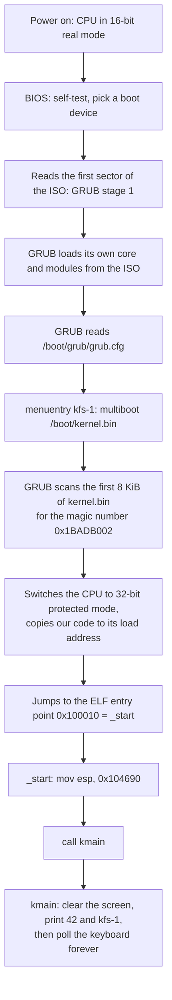

# How kfs-1 works

Written for a programmer who is comfortable in C, C++, Python or TypeScript and
has never touched assembly, a kernel, or a bootloader. Unfamiliar words are
defined in [GLOSSARY.md](GLOSSARY.md).

Every address, byte value and size below was measured from the artifacts this
repo builds, with `objdump`, `readelf` and the QEMU monitor. Nothing here is
idealised.

## 1. The one idea you need first

Every program you have ever written ran **on top of** an operating system.
`printf`, `malloc`, `open`, `Promise`, `import` — all of those are requests to a
kernel. This project is the thing that would have answered them.

So take away everything the OS was doing for you:

| You are used to | Here |
|---|---|
| The loader picks addresses for your code | You write the addresses out by hand |
| `main` starts with a working stack | The stack pointer holds garbage until you set it |
| `printf` prints | Nothing prints. There is no console, only a grid of memory the screen happens to read |
| `malloc` gives you memory | There is no heap. Nobody wrote one yet |
| A segfault kills your process | Nobody kills anything. The machine reboots |
| Threads, files, sockets | None of it exists |

That last row is why the code is so small: there is nothing to call.

## 2. What exists today

Working:

- An assembly boot stub that sets up a stack and calls into Rust.
- A `no_std` Rust kernel whose entry point is `kmain`, plus the panic handler
  the language demands.
- A VGA text driver — clear, print, colours, a tracked cursor with line
  wrapping and scrolling, the blinking hardware cursor parked after our
  output — and `kmain` using it to display "42" and a green "kfs-1". The
  screen model and the module are [VGA.md](VGA.md).
- The start of a kernel library: C-string helpers for the multiboot data GRUB
  hands us, and number-to-text conversion. The displayed "42" actually goes
  through it.
- `printk!` — `core`'s whole formatting engine hooked onto the screen through
  one trait impl. Panics now print themselves in red instead of silently
  freezing the machine.
- A polled PS/2 keyboard driver: after the banner, `kmain` echoes what you
  type — Shift, Enter and Backspace included.
- Three virtual screens, switched with F1/F2/F3, each keeping its own
  contents, cursor and colour while off-screen.
- A custom compilation target: 32-bit x86, no floating-point hardware, no OS
  underneath.
- A linker script placing the kernel at 1 MiB with the multiboot header first.
- A bootable GRUB ISO, 5 085 184 bytes (the subject's limit is 10 MiB).
- `make check`, which proves the kernel is really executing *and* really drew
  "42" on the screen.

Deliberately absent:

- Interrupt handling, our own segment table, paging, a serial port, a memory
  allocator, user space. None of it is needed to boot, print and echo keys —
  though interrupts are what will turn the keyboard from polled to
  event-driven in the next KFS.

## 3. Power-on to `kmain`

A **bootloader** is a small program whose only job is to find a kernel, load it
into memory, and jump to it. We use GRUB, the standard Linux one, because
writing your own means talking to disk controllers in 16-bit mode.



Only three links in that chain are ours: the magic number GRUB looks for, the
`grub.cfg` line naming our binary, and `_start`. Everything before them is
firmware and GRUB doing their ordinary jobs.

### The handshake with GRUB

GRUB will not load an arbitrary file. It follows a published contract called
**multiboot**: put a recognisable 12-byte header near the front of your binary
and any compliant bootloader will load you and hand over a CPU already in
32-bit mode. Find the header, load and jump. Miss it, refuse the file. That is
the whole agreement, and our half of it is fourteen lines of `boot/boot.asm`.

### Why the stack has to come first

GRUB jumps to `_start` with interrupts off and the stack pointer register `esp`
holding **whatever was left in it** — an address that means nothing.

A function call pushes its return address onto the stack. That is true in C, in
Rust, in every compiled language. So calling *anything* before `esp` points at
real memory writes a return address into a random location and corrupts it.

And you cannot fix this in Rust, because Rust code needs a working stack in
order to run at all. "The stack does not exist yet" is not a state Rust can
express. That single problem is the entire reason there is an assembly file in
this repo.

## 4. The files that are the project

Everything else is documentation or build plumbing.

### `boot/boot.asm` — fourteen bytes of assembly

Assembly is one CPU instruction per line and no abstractions at all. NASM turns
this file into a 928-byte 32-bit object file. It contributes three pieces:

| Section | Size | What it is |
|---|---|---|
| `.multiboot` | 12 B | the header GRUB searches for |
| `.text` | 14 B | `_start` and a hang loop |
| `.bss` | 16 KiB | the kernel stack |

**The header** is three 32-bit numbers:

```nasm
MAGIC    equ 0x1BADB002          ; fixed value the spec mandates
FLAGS    equ MBALIGN | MEMINFO   ; 1<<0 | 1<<1 = 3
CHECKSUM equ -(MAGIC + FLAGS)    ; = 0xE4524FFB
```

The validity test is one line of arithmetic: the three must add up to zero in
32-bit maths. `0x1BADB002 + 3 + 0xE4524FFB = 0x100000000`, which overflows to
0. Here it is in the finished binary:

```
Contents of section .multiboot:
 100000 02b0ad1b 03000000 fb4f52e4
```

x86 stores numbers least-significant byte first, so those bytes read back as
`0x1BADB002`, `0x00000003`, `0xE4524FFB`. The build also checks this
independently with `grub-file --is-x86-multiboot build/kernel.bin`.

The two flags ask GRUB to page-align any modules it loads and to pass us a map
of physical memory. We ignore the map today; asking costs nothing and a future
memory allocator will want it.

**The stack** is 16 KiB of `.bss`:

```nasm
section .bss
align 16
stack_bottom:
    resb 16384
stack_top:
```

`resb` means "reserve these bytes, do not store them in the file" — `.bss` is
memory the loader is told to hand over as zeros. Closer to `calloc` than to a
literal array of 16 384 zeros compiled into the binary. x86 stacks grow
*downwards*, so the starting `esp` is `stack_top`, the **higher** address.

**`_start`** is where GRUB jumps. Disassembled from the real binary:

```
00100010 <_start>:
  100010: bc 90 46 10 00    mov  $0x104690,%esp
  100015: e8 06 00 00 00    call 100020 <kmain>

0010001a <_start.hang>:
  10001a: fa                cli
  10001b: f4                hlt
  10001c: eb fc             jmp  10001a
```

`0x104690` is `stack_top` after the linker resolved it: `stack_bottom` at
`0x100690` plus 16 384. The hang loop below the `call` is unreachable while
`kmain` never returns, but it is the right thing to have there: `cli` switches
interrupts off, `hlt` stops the CPU until one arrives anyway, and the `jmp`
re-halts if something wakes it. Halting is not spinning — `hlt` lets a physical
CPU idle instead of burning a core at 100%.

`global _start` exports the name so the linker can find it. `extern kmain`
promises the name exists somewhere else; the linker fills in the address.

The trailing `.note.GNU-stack` line is an empty marker section. Without it,
modern `ld` warns that the stack might be executable. Cosmetic, two lines,
silent build.

### `kernel/src/lib.rs` — the kernel

```rust
#![no_std]

mod keyboard;
mod klib;
mod printk;
mod vga;

use printk::printk;

#[no_mangle]
pub extern "C" fn kmain() -> ! {
    vga::clear();
    let mut buf = [0u8; 10];
    vga::print(klib::utoa(42, &mut buf));
    vga::print("\n");
    vga::set_color(vga::Color::BrightGreen, vga::Color::Black);
    printk!("kfs-{}\n", 1);
    vga::set_color(vga::Color::White, vga::Color::Black);
    loop {
        match keyboard::poll() {
            Some(keyboard::Key::Char(b)) => vga::put_char(b),
            Some(keyboard::Key::Backspace) => vga::backspace(),
            Some(keyboard::Key::Screen(n)) => vga::switch_screen(n),
            None => core::hint::spin_loop(),
        }
    }
}

#[panic_handler]
fn panic(info: &PanicInfo) -> ! {
    vga::set_color(vga::Color::BrightRed, vga::Color::Black);
    printk!("\npanic: {}\n", info);
    loop { core::hint::spin_loop(); }
}
```

Read against what you already know:

| Written here | What it means |
|---|---|
| `#![no_std]` | Drop Rust's standard library; it assumes an OS. Keep `core`: integers, slices, `Option`, no I/O, no heap. In C terms: `-ffreestanding`, no libc. |
| `#[no_mangle]` | `extern "C"` in C++. Keep the symbol named literally `kmain`, because the assembly file wrote `call kmain`. |
| `extern "C"` | Use the C calling convention, so assembly and Rust agree on what a call looks like. |
| `-> !` | "Never returns." A promise to the compiler, and the reason the body must be an infinite loop. |
| `#[panic_handler]` | Mandatory without `std`. A panic normally aborts the *process*; there are no processes. You must say where panics go. Ours spins forever. |

`core::hint::spin_loop()` emits the x86 `pause` instruction — a hint that this
loop is waiting on something, which saves power and avoids a pipeline penalty.
After the banner, `kmain` *is* that loop: ask the keyboard, echo the answer,
pause. The optimiser inlines every driver into `kmain`, and the check finds
`EIP` somewhere inside the loop's ~1.3 KB whenever it samples the guest.

The panic handler prints the panic — location, message, formatted values — in
bright red before idling, which turns the failure mode from "screen freezes"
into an actual error report. Two things worth knowing about it:

- Printing from a panic reuses the very driver the panicking code may have
  been in the middle of. That is acceptable precisely because a panic is
  terminal: nothing runs afterwards, so corrupt-looking output is a cosmetic
  risk, not a correctness one.
- It is not in the shipped binary. Link-time optimisation proved that no code
  path in today's kernel can actually panic (`put_cell`'s bound check is a
  `debug_assert!`, `utoa` cannot fail, the one `printk!` folds at compile
  time), so the whole handler — and with it all of `core::fmt`'s machinery —
  is dead code and gets dropped. Introduce a real `panic!` and it all comes
  back: measured by temporarily panicking in `kmain` (at the commit that
  added printk), which grew `kernel.bin` from 2 016 to 7 044 bytes and
  printed `panicked at src/lib.rs:21:5` in red on boot.

### `kernel/src/klib.rs` — the start of a kernel library

The subject asks for "basic functions (strlen, strcmp, ...)" because a kernel
has no libc. In Rust most of that shelf already exists: `core` provides
`str::len` and slice comparison, and the build's `compiler-builtins-mem`
feature provides `memcpy`/`memset`/`memcmp`. What is genuinely missing are the
C-shaped pieces, so that is what `klib` holds:

- `strlen` / `strcmp` over NUL-terminated C strings — the format GRUB's
  multiboot info structure uses, which the memory-map work will need to read.
  No caller yet; they are `unsafe fn` because a raw pointer walk cannot be
  checked by the compiler.
- `utoa` — render a `u32` in decimal into a caller-provided buffer, no heap,
  no `core::fmt`. This one is live: `kmain` prints "42" by actually computing
  `utoa(42, &mut buf)`.

The punchline is what the optimiser did with that: `utoa(42)` is a pure
function of a constant, so LLVM evaluated the whole digit loop at compile
time — at the commit introducing it, the linked binary came out byte-for-byte
identical to the literal-string version. The helper is real, exercised on the
mandatory path, and free.

### `kernel/src/printk.rs` — printf without an OS

`core` cannot print — but it ships the complete formatting engine, held back
by one missing piece: somewhere for the text to go. The contract is
`core::fmt::Write`: implement a single method, `write_str`, and the trait
hands you `write_fmt` and with it every `{}`, `{:x}`, width and padding rule
Rust has. `vga::Writer` is that implementation (three lines: forward to
`vga::print`), and `printk!` wraps `core::format_args!` the way `println!`
does in userland. No allocation anywhere: `format_args!` compiles the format
string into a series of `write_str` calls at compile time.

This is the classic Rust-kernel move — the standard library's I/O is gone,
but the *language-level* machinery (traits, `format_args!`) never depended on
an OS in the first place.

### `kernel/src/keyboard.rs` — asking the keyboard instead of listening

The PS/2 keyboard does not send characters. Its 8042 controller (status port
`0x64`, data port `0x60`) delivers **scancodes** — numbers naming physical key
positions, press and release separately — and turning those into ASCII against
a layout table is the driver's whole job. Shift is just two more scancodes
whose press/release toggles a flag; F1-F3 come back as "switch screen"
commands rather than characters.

Polled, not interrupt-driven: `kmain` asks "anything for me?" (status bit 0)
on every lap of its loop, because the alternative — the keyboard interrupting
the CPU — needs an IDT, which is the next KFS project. Polling burns the CPU
politely (`pause`) and loses nothing at human typing speed.

### `kernel/src/vga.rs` — the screen driver

The screen is not a device you ask politely: it is 4 000 bytes of memory at
`0xb8000` that the display hardware repaints from sixty times a second. The
module writes u16 cells (colour byte + ASCII byte) into it through
`core::ptr::write_volatile` — `volatile` because these stores are never read
back, and a store whose result is unused is exactly what an optimiser deletes.
Public entry points — `clear()`, `set_color(fg, bg)`, `print(&str)`,
`put_char(u8)`, `backspace()`, `switch_screen(n)` — over a tracked write
position: `\n`, wrapping at column 80, scrolling at the bottom row, and the
blinking hardware cursor re-parked after each print through the CRT
controller's I/O ports. Three virtual screens live behind it: the active one
exists only in the real buffer at `0xb8000`; switching copies the live 4 000
bytes into the leaving screen's save slot and the entering screen's slot back
— contents, cursor and colour all travel. The full story — the cell format,
why `volatile`, the port I/O, the `.bss` trick that keeps 12 KiB of screen
slots out of the binary — is [VGA.md](VGA.md).

### `linker.ld` — where the code lands in RAM

Normally the compiler, the linker's default script and the OS loader agree on
addresses without asking you. Here none of them exist, so you write it out:

```ld
ENTRY(_start)
SECTIONS
{
    . = 1M;
    .multiboot : { *(.multiboot) }
    .text      : { *(.text*) }
    .rodata    : { *(.rodata*) }
    .data      : { *(.data*) }
    .bss       : { *(COMMON) *(.bss*) }
}
```

`.` is the location counter: the address currently being handed out. Two
decisions matter in those five lines.

**Start at 1 MiB.** The first megabyte of physical memory is not ours. It holds
the real-mode interrupt vector table, BIOS data, memory-mapped ROM, and the VGA
text screen at `0xb8000`. 1 MiB (`0x100000`) is the conventional first address
a loaded kernel may claim.

**`.multiboot` first,** so the header lands inside the 8 KiB window GRUB
scans. `*(.text*)` then gathers `.text` out of every input file — our `boot.o`
plus every object inside `libkernel.a` — into one output section.

The result:

| Section | Address | Size | Notes |
|---|---|---|---|
| `.multiboot` | `0x100000` | 12 B | magic, flags, checksum |
| `.text` | `0x100010` | 1 381 B | `_start` and `kmain` with every driver inlined |
| `.rodata` | `0x100528` | 266 B | the two 58-byte scancode tables, `"kfs-1\n"`, alignment |
| `.data` | `0x100682` | 2 B | compiler leftovers |
| `.bss` | `0x100690` | 27.8 KiB | the stack (16 KiB), three screen save slots (12 KiB), driver state; never stored on disk |

The ELF ends up with a single loadable chunk: 1 680 bytes on disk expanding
to 30 101 bytes in RAM, the difference being the `.bss` the loader must
provide but never reads from the file — including the three 4 KiB screen
slots, kept deliberately zero-initialised so they cost nothing on disk
([VGA.md](VGA.md)). `build/kernel.bin` is 3 112 bytes total; the rest is ELF
bookkeeping.

The link command:

```sh
ld -m elf_i386 -n -T linker.ld -o build/kernel.bin \
   build/boot.o kernel/target/i686-kfs/release/libkernel.a
```

`-m elf_i386` asks for 32-bit x86 output, since the host `ld` defaults to
64-bit. `-n` switches off page-alignment of sections, keeping the image small
and the layout literal. `-T` supplies our script instead of the host's default.

> The subject forbids reusing the host's linker *script*, not the host's
> linker. `ld` is a tool; `linker.ld` is ours.

### `kernel/i686-kfs.json` — inventing a platform

You normally pick a target off a shelf: `x86_64-apple-darwin`,
`i686-unknown-linux-gnu`. Every one of those names an operating system, and
that is a lie here. There is no shelf entry for "32-bit x86, nothing
underneath", so the spec sheet is written by hand:

| Field | Why |
|---|---|
| `"llvm-target": "i686-unknown-none"` | 32-bit x86, no OS |
| `"data-layout"` | type sizes and alignments for i686; must match the LLVM target or codegen is subtly wrong |
| `"arch": "x86"`, `"target-pointer-width": 32` | 32-bit pointers |
| `"cpu": "pentium4"` | the baseline instruction set to compile for |
| `"os": "none"` | no syscalls, no libc assumptions |
| `"panic-strategy": "abort"` | there is no unwinder to unwind into |
| `"features": "-mmx,-sse,+soft-float"` | forbid the vector units, do float maths in software |
| `"rustc-abi": "softfloat"` | consistent with the above: floats travel in integer registers |
| `"disable-redzone": true` | the red zone is 128 bytes below `esp` a function may scribble in without reserving. Legal in userland, fatal once interrupt handlers exist — they push data there and silently eat it |
| `"max-atomic-width": 64` | 64-bit atomics work on this CPU via `cmpxchg8b` |
| `"linker-flavor"`, `"linker"` | only used if cargo does the linking. We link ourselves, so these are inert |

The SSE line is the one worth understanding. Floating-point and vector units on
x86 have to be switched on explicitly after boot, by setting bits in CPU
control registers. If the optimiser emitted a single SSE instruction before
that happened, the CPU would raise an exception, find no handler installed, and
triple-fault. Banning an instruction set we do not use is cheaper than
initialising hardware we do not need.

Because no prebuilt standard library exists for a target we just invented,
`kernel/.cargo/config.toml` rebuilds one from source:

```toml
[build]
target = "i686-kfs.json"

[unstable]
json-target-spec = true
build-std = ["core", "compiler_builtins"]
build-std-features = ["compiler-builtins-mem"]
```

`build-std` compiles `core` and `compiler_builtins` for our target.
`compiler-builtins-mem` supplies `memcpy`, `memset` and `memcmp` in Rust: LLVM
emits calls to those names for struct copies and slice operations, and on a
normal system libc provides them. We have no libc. `json-target-spec` is what
permits `.json` target files on current nightly at all, and nightly itself is
required because rebuilding `core` is an unstable feature — pinned in
`rust-toolchain.toml` so `rustup` handles it without manual juggling.

`Cargo.toml` asks for `lto = true` with a single codegen unit: whole-program
link-time optimisation is what lets the compiler prove `core::fmt`'s
machinery unreachable today and drop it — measured when `printk` landed:
2 KB to 430 KB without LTO, back to 2 KB with it (see the panic handler
notes above). And it asks for `crate-type = ["staticlib"]`, so cargo produces
`libkernel.a` (748 246 bytes) instead of an executable: a bag of parts for our
own `ld` invocation to assemble, rather than a finished program linked with the
wrong script. `panic = "abort"` in both profiles strips the unwinding machinery,
which would otherwise want a runtime we do not have.

### `grub.cfg` — the boot menu

```
set timeout=0
set default=0
menuentry "kfs-1" {
    multiboot /boot/kernel.bin
    boot
}
```

`timeout=0` boots straight through with no menu. `multiboot` is the GRUB
command that loads a multiboot-1 kernel: it validates the header, copies the
image to its load address and enters 32-bit protected mode. `boot` transfers
control. The path is inside the ISO, not on your machine — `make` stages
`build/iso/boot/kernel.bin` and `build/iso/boot/grub/grub.cfg` before calling
`grub-mkrescue`.

### `Makefile` — four artifacts in order

```
boot/boot.asm ──nasm -f elf32──────────────► build/boot.o        (928 B)
kernel/src/*  ──cargo build --release──────► libkernel.a         (341 KB)
both          ──ld -m elf_i386 -n -T ...───► build/kernel.bin    (3 112 B)
kernel.bin    ──grub-mkrescue──────────────► kfs.iso             (5 085 184 B)
```

A 3 KB kernel produces a 5 MB image because `grub-mkrescue` copies GRUB itself
and its entire module tree — 294 files in this build — onto the ISO.

Worth knowing:

- GRUB's tool names are auto-detected: Fedora ships `grub2-mkrescue` and
  `grub2-file`, Debian ships `grub-mkrescue` and `grub-file`.
- `cargo` is a **phony** target. Cargo's own change detection is better than
  anything Make could model for Rust, so Make always delegates. The cost is
  that `kernel.bin` relinks every build, and linking 1 KB is free.
- Two assertions run inside the build rather than as separate steps:
  `grub-file --is-x86-multiboot` on the linked binary, and a size check that
  fails the build above 10 485 760 bytes.
- `clean` / `fclean` / `re` follow 42 conventions. `clean` also runs
  `cargo clean`, or `kernel/target` (hundreds of MB) would survive it.
- `docker-%` is a pattern rule: `make docker-check` builds the dev image and
  runs `make check` inside it. There is no separate in-container logic — the
  container runs the same native rules against the bind-mounted repo. It exists
  because this development machine is arm64 macOS with no x86 toolchain;
  evaluation on Fedora never uses it.

## 5. What the screen shows

Boot the ISO and you get a black screen with a white "42" on the first row, a
bright-green "kfs-1" on the second, and a blinking cursor at row 2, column 0.
Each part has a cause:

Type, and it echoes where the cursor blinks — Shift, Enter, Backspace all
behave; F1/F2/F3 switch between three independent screens. Each part of the
boot picture has a cause:

1. **The black screen** is `vga::clear()`: 2 000 cells overwritten with a
   white-on-black space, erasing the grey text GRUB printed while loading.
   Before this existed, GRUB's leftovers stayed lit forever — nothing else
   ever wrote to the buffer.
2. **The "42"** is `kmain` printing `klib::utoa(42, ...)`: two white-on-black
   cells at `0xb8000` and `0xb8002`, the top-left of the grid. **The
   "kfs-1"** is the same path after `set_color(BrightGreen, Black)`.
3. **The cursor** is hardware state, not a character: it lives in CRT
   controller registers reached through I/O ports `0x3D4`/`0x3D5`, and the
   driver re-parks it after each print — row 2, column 0 is exactly where the
   output ends. It blinks with the attribute of the cell it sits on, which
   `clear()` painted white-on-black. (Before the driver programmed it, it
   just blinked wherever GRUB abandoned it.)

Real failures look different:

| Symptom | Diagnosis |
|---|---|
| BIOS splash and GRUB menu reappear in a loop | triple fault: the CPU faulted, faulted handling that, gave up and reset |
| A GRUB error instead of `Booting` | bad multiboot header, or a wrong path in `grub.cfg` |
| `EIP` below `0x100000` | execution left the kernel: bad jump, or the image never loaded |
| QEMU monitor unreachable | the process died outright |

## 6. How we prove it works

You cannot `assert` from inside this kernel. There is no test harness, no
process to exit with a status, and nowhere to print. So `make check` is a unit
test for the whole machine, asking the emulator from the outside where the CPU
ended up and what the screen holds:

1. Start QEMU with no window and a control socket:
   `-display none -monitor unix:/tmp/kfs-mon,server,nowait`.
2. Poll `info registers` over the socket every 2 s, for up to 60 s, until
   `EIP` lands inside `[0x100000, 0x200000)`. A fixed sleep proved flaky:
   boot takes a few seconds natively but can take three times that inside
   the emulated dev container. Both bounds are needed — GRUB runs below
   1 MiB *and*, relocated, near the top of RAM (`EIP=0x07f7d106` was
   observed mid-boot), so "at least 1 MiB" alone can pass too early.
3. Dump the frame with `screendump`, retrying for up to 10 s while it still
   shows GRUB's text — qemu repaints its display surface on its own timer,
   so a dump taken milliseconds after the kernel's writes can predate them.
4. Require the final frame to contain pure-white pixels (the "42" glyphs) and
   none of GRUB's grey `#a8a8a8` (proof the clear ran) —
   [VGA.md](VGA.md#how-it-is-verified) details why that pair of greps is
   sound.

Three independent facts have to hold for that to pass: QEMU was still alive to
answer at all, the instruction pointer is inside the kernel's address range,
and the kernel's writes really reached the VGA buffer.

```
OK: kfs.iso is 5085184 bytes (limit 10485760)
OK: guest alive, EIP=001002fa inside kernel
OK: screen cleared and "42" glyphs lit
```

`kmain` occupies `0x100020`-`0x100585`; the exact `EIP` depends on where in
the keyboard-polling loop the sample lands. GRUB accepted the header,
`_start` set `esp`, Rust ran the VGA writes to completion, and the machine is
not rebooting in a loop.

`make re` is the other check that matters: a full `fclean` and rebuild proves
the clean targets really remove everything and that the build works from
nothing.

## 7. Toolchain the numbers came from

```
NASM 2.16.01
GNU ld (Binutils) 2.40
rustc 1.99.0-nightly (1ed2df61a 2026-08-04)
grub-mkrescue (GRUB) 2.06
QEMU qemu-system-i386
```

Sizes and addresses shift a little with other versions. The structure does not.
