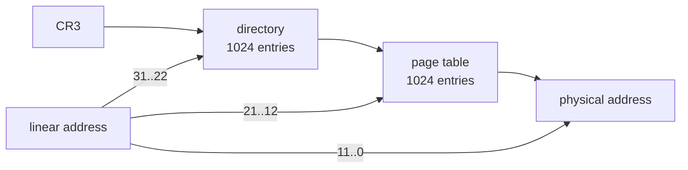

# Paging

Paging puts a translation step between the addresses in the kernel's code and
the addresses that reach the memory chips. `boot/boot.asm` turns it on before
the first Rust instruction runs, and `kernel/src/paging.rs` owns it afterwards.
The allocators that live in the address space described here are in
[MEMORY.md](MEMORY.md), what happens when a translation fails is in
[PANIC.md](PANIC.md), the descriptor table that paging must keep reachable is
in [GDT.md](GDT.md), and unfamiliar words are in [GLOSSARY.md](GLOSSARY.md).

## What paging is for

Without paging, an address in a register is an address on the bus. Every piece
of code sees the same memory, and any pointer can reach any byte. The subject
asks for three things that are impossible in that world:

- **One address space per process.** Two programs both want to start at the
  same address. With paging, one linear address can point at different physical
  memory depending on which table is loaded.
- **Memory rights.** A page can be read only, or reserved for ring 0. Rights
  become a property of the translation, not of the code doing the access.
- **Allocating and freeing address space.** Address space and physical memory
  stop being one resource. A heap can grow into addresses nothing backs yet,
  and scattered frames can be presented as one contiguous range.

This kernel gets the second and third. One table serves the whole machine,
because there is no process yet. Setting bit 31 of CR0 changes the meaning of
every address the CPU computes, including the one in the instruction pointer:

- Every access and every instruction fetch goes through the table whose
  physical address sits in CR3, and an address with no valid translation raises
  exception 14, a page fault, instead of reading memory.
- Registers the manuals call linear stop meaning physical. `lgdt` takes a
  linear address, so the descriptor table at physical `0x00000800` stays
  reachable only while linear `0x00000800` still points at it.
- The stack pointer, the return addresses on the stack and the running code all
  become virtual. The instruction that sets the bit must already sit at an
  address the new table maps.

## The translation the hardware performs

CR3 holds the physical address of a page directory: one 4 kb page of 1024
entries of 4 bytes. Each present entry holds the physical address of a page
table, another 4 kb page of 1024 entries. Each present table entry holds the
physical address of a 4 kb page of memory. A 32-bit linear address splits into
three fields that cover the three levels exactly, with no bit left over: bits
31 to 22 are the directory index, bits 21 to 12 the table index, bits 11 to 0
the offset. Ten bits index 1024 entries, twelve bits address 4096 bytes.
`paging.rs` reads them with `dir_index` (`addr >> 22`), `table_index`
(`(addr >> 12) & 0x3ff`) and `offset` (`addr & 0xfff`).



One directory entry covers `1024 * 4096` bytes, which is 4 MB. That is
`mem::TABLE_SPAN`, the unit in which this kernel thinks.

### Why 20 bits are enough for a physical address

An entry is 32 bits and must hold an address plus the rights. Both a page table
and a page of memory are 4 kb aligned, so the low 12 bits of the address they
point at are always zero. Only bits 31 to 12 carry information. The hardware
keeps those 20 bits at the top of the entry and reuses the freed 12 for flags,
which `paging.rs` splits with `FLAGS = 0xfff` and `FRAME = !0xfff`. Twenty bits
of frame number, 4 kb each, addresses 4 GB, so nothing is lost.

### One real address, walked end to end

`virt 0xc0101000` performs the walk in software and prints every step:

```
kfs> virt 0xc0101000
0xc0101000: directory 768 table 257 offset 0 in kernel space
  directory entry 0x00138023 -> table at 0x00138000, rw kernel
    p 1 rw 1 us 0 a 1 d 0 ps 0 g 0 pwt 0 pcd 0
  table entry     0x00101021 -> frame at 0x00101000, r  kernel
    p 1 rw 0 us 0 a 1 d 0 ps 0 g 0 pwt 0 pcd 0
  physical        0x00101000
```

1. `0xc0101000 >> 22` is 768, so the CPU reads directory entry 768.
   `(0xc0101000 >> 12) & 0x3ff` is 257, so it then reads table entry 257. The
   offset is 0, and `mem::space_of` calls the address kernel space because it
   is at or above `0xC0000000`.
2. Entry 768 reads `0x00138023`. Masking the low 12 bits gives `0x00138000`,
   the kernel-window table. Flags `0x23` are present, writable and accessed,
   and `us 0` keeps ring 3 out of the whole 4 MB.
3. Entry 257 reads `0x00101021`. The frame is `0x00101000`, and `rw 0` makes it
   read only. It is the first page of `.text`.
4. The physical address is the frame plus the offset, `0x00101000 | 0`.

The kernel wrote neither `0x20` bit: it stored `0x00138003` and `0x00101001`.
The CPU sets the accessed bit itself the first time it uses an entry.

## The entry format

A directory entry and a table entry share a layout. The subject names nine
flags, and `paging.rs` gives each a constant:

| bit | name | constant | this kernel |
| --- | ---- | -------- | ----------- |
| 0 | P, present | `PRESENT` | set on every live entry |
| 1 | R/W | `WRITABLE` | set unless the page is read only |
| 2 | U/S | `USER` | set only on user-space pages |
| 3 | PWT | `WRITE_THROUGH` | never set |
| 4 | PCD | `NO_CACHE` | never set |
| 5 | A, accessed | `ACCESSED` | read only, the CPU sets it |
| 6 | D, dirty | `DIRTY` | read only, the CPU sets it |
| 7 | PS, page size | `LARGE` | always 0 |
| 8 | G, global | `GLOBAL` | never set |
| 11-9 | available | none | left at 0 |
| 31-12 | frame | `FRAME` mask | the physical frame |

PS stays 0 because this kernel uses 4 kb pages and nothing else. A directory
entry with PS set would describe one 4 MB page directly, with no table below
it, and that needs the PSE bit in CR4, which the kernel never touches. So a
directory entry here always points at a table, and every 4 MB region costs one
extra frame for that table. Bit 6 of a directory entry is ignored by the
hardware when PS is 0, which is why the `user` command prints `d 1` on one, and
nothing reads it. Four combinations cover everything the kernel maps, and
`paging::rights` turns R/W and U/S back into the four strings every command
prints: `rw kernel`, `r  kernel`, `rw user`, `r  user`.

```rust
pub const KERNEL_PAGE: u32 = PRESENT | WRITABLE;
pub const KERNEL_READONLY: u32 = PRESENT;
pub const USER_PAGE: u32 = PRESENT | WRITABLE | USER;
pub const USER_READONLY: u32 = PRESENT | USER;
```

## Why the kernel lives in the higher half

The kernel is linked at `0xC0100000` and loaded at physical `0x00100000`. User
space needs a long contiguous low range, and the kernel needs somewhere no user
mapping reaches. Putting the kernel at the top gives both, and it lets every
process later share one set of kernel directory entries. One obstacle stands in
the way: GRUB jumps to the ELF entry point with paging off, so the entry point
cannot be a higher-half address. `linker.ld` gives one small section a virtual
address equal to its load address:

```
    . = KERNEL_LOAD;
    boot_start = .;
    .boot ALIGN(4K) : { KEEP(*(.multiboot)) *(.boot) }
    boot_end = .;

    . += KERNEL_SPACE;
    . = ALIGN(4K);
    kernel_start = .;

    .text : AT(ADDR(.text) - KERNEL_SPACE) { *(.text*) }
```

`.boot` holds the multiboot header and `_start`, and it gets no `AT()`, so its
virtual address is `0x00100000`, where GRUB loads it. Everything after it moves
up by `KERNEL_SPACE`, and every later section carries
`AT(ADDR(...) - KERNEL_SPACE)`, which keeps the load address low while the
symbols resolve high. `.boot` ends at `0x00100061`, so the 4 kb alignment puts
`.text` at `0xC0101000`, loaded at `0x00101000`. The program headers of
`build/kernel.bin` show both halves of the trick:

```
  LOAD  Offset 0x0000a0  VirtAddr 0x00100000  PhysAddr 0x00100000  ...  R E
  LOAD  Offset 0x001000  VirtAddr 0xc0101000  PhysAddr 0x00101000  ...  RWE
```

The first segment has `VirtAddr` equal to `PhysAddr`, the second does not, and
the entry point is `_start` at `0x00100010`, inside the first segment. The
first attempt did not do this. It linked the whole image, entry point included,
at `0xc0101000`. The build did not fail, because a linker places code wherever
it is told. Disassembling the result showed the entry point at `0xc0101000`, an
address no memory answers on a machine with no paging. GRUB would have jumped
there and the machine would have crashed before a single instruction of the
kernel ran.

## The boot switch, step by step

`.boot` runs at its physical address, so every `.bss` symbol needs
`KERNEL_SPACE` subtracted before it can be used as a pointer. GRUB leaves the
multiboot magic in `eax` and the information pointer in `ebx`; the table loop
needs both registers, so the first two instructions move them to `esi` and
`edi`. Then one page table is filled, where entry `i` maps linear `i * 4096` to
physical `i * 4096`, present and writable, so 1024 entries cover the first
4 MB:

```asm
    mov edx, boot_low_table - KERNEL_SPACE
    mov eax, PAGE_PRESENT | PAGE_WRITE
    mov ecx, ENTRIES
.identity:
    mov [edx], eax
    add eax, PAGE_SIZE
    add edx, 4
    loop .identity
```

`add eax, PAGE_SIZE` increments the frame field and never disturbs the flags,
because the flags occupy the low 12 bits and the increment is 4096. Three
directory entries follow. Entry 0 covers `0x00000000..0x003FFFFF` and entry
`KERNEL_DIR`, which is `0xC0000000 >> 22` and therefore 768, covers
`0xC0000000..0xC03FFFFF`. Both get the same table, so the same 4 MB answers at
two linear addresses. Entry 1023 gets the directory itself, which is the
[recursive window](#the-recursive-page-table-window):

```asm
    mov edx, boot_directory - KERNEL_SPACE
    mov eax, (boot_low_table - KERNEL_SPACE) + PAGE_PRESENT + PAGE_WRITE
    mov [edx], eax
    mov [edx + KERNEL_DIR * 4], eax
    mov eax, (boot_directory - KERNEL_SPACE) + PAGE_PRESENT + PAGE_WRITE
    mov [edx + (ENTRIES - 1) * 4], eax
```

Entry 0 keeps the running code alive across the switch, and entry 768 makes the
higher half exist. CR3, CR0 and the jump come next. The jump must be absolute:
a plain `jmp` to a label assembles as a relative displacement and would leave
the instruction pointer in the low window forever.

```asm
    mov cr3, edx
    mov eax, cr0
    or eax, PAGE_ENABLE
    mov cr0, eax
    mov eax, higher_half
    jmp eax
```

Translation is live from the `mov cr0` onward, and the instruction pointer is
still inside `.boot`, low in the first megabyte, which entry 0 maps to itself.
`higher_half` is `0xc0101000` in the measured build. Directory entry 768 sends
it through the same identity table, entry 257, to physical `0x00101000`, which
is where the linker put `.text`. Only after the jump is `stack_top`, a `.bss`
symbol and therefore a higher-half address, legal to use:

```asm
higher_half:
    mov esp, stack_top
    mov ebp, esp
    push edi
    push esi
    call kmain
```

The pushes are reversed because the calling convention puts the first argument
nearest the top of the stack. `esi` holds the magic and lands first, `edi`
holds the information pointer and lands second, which matches
`kmain(magic: u32, info: u32)` in `kernel/src/lib.rs`. It hands both to
`mem::init`. The stack region itself is described in [STACK.md](STACK.md).

## What paging::init builds

The boot table is correct but blunt: all 4 MB writable, the kernel's own code
included. `mem::init` calls `paging::init(&image)` to replace it with a table
carrying per-section rights. That table is `static mut KERNEL_TABLE`, a
`#[repr(align(4096))]` array of 1024 entries in `.bss`, already inside the
mapped kernel image, so creating it costs no allocation. `init` fills all 1024
entries with the same identity relation and takes the rights from the linker
symbols `kernel_start` and `kernel_readonly_end`, between which lie `.text` and
`.rodata`. `.data` and `.bss` are above `readonly_end` and stay writable, and
so does everything below the image:

```rust
let readonly = virt >= image.start && virt < image.readonly_end;
let flags = if readonly { KERNEL_READONLY } else { KERNEL_PAGE };
write_volatile(table.add(i), phys | flags);
```

Installing the table is one store:

```rust
let phys = mem::kernel_phys(addr_of!(KERNEL_TABLE.0) as u32);
write_volatile(DIRECTORY.add(dir_index(mem::KERNEL_SPACE)), phys | KERNEL_PAGE);
```

One dword is enough because nothing has to move. The table already exists and
is already reachable. Its physical address is its virtual address minus
`0xC0000000`, which is what `mem::kernel_phys` computes, and it is `0x00138000`
in the measured build. The directory is reachable at `0xFFFFF000` through the
recursive entry, so the store writes `0x00138003` at `0xFFFFF000 + 768 * 4`.
From the next translation onward, a different table describes the higher half.
`init` then calls `flush()`, which reloads CR3 and drops the whole TLB, and
sets bit 16 of CR0.

### Why CR0.WP matters

Without CR0.WP the R/W bit is enforced for ring 3 only, and ring 0 may write
any present page, read only or not. This kernel runs entirely in ring 0, so the
read-only marks would state an intention and enforce nothing. The subject asks
for memory rights, and rights the only running code can ignore are not rights.
With bit 16 set, a supervisor write to a page with R/W clear faults like any
other violation. CR0 reads `0x80010011` on the running kernel: bit 31 PG, bit
16 WP, bit 4 ET, bit 0 PE. `fault ro` proves the effect from inside; see
[PANIC.md](PANIC.md). The external proof is `info mem` in the QEMU monitor,
which reads the CPU's own tables and knows nothing about the kernel's opinion
of them:

```
0-400000          -rw
c0000000-c0101000 -rw
c0101000-c010d000 -r-
c010d000-c0400000 -rw
ffc00000-ffc01000 -rw
fff00000-fff01000 -rw
fffff000-100000000 -rw
```

The third line is `.text` and `.rodata`, and it is `-r-`. The ranges above and
below it are `-rw`.

## The address-space map

`space` prints the plan. Every bound is a constant in `kernel/src/mem.rs`, and
the table is `mem::LAYOUT`:

```
kfs> space
 range                  owner   region        contents
 0x00000000..0x003fffff kernel  low window    identity: gdt, vga, kernel image
 0x00400000..0x007fffff user    user space    free for user pages
 0x00800000..0x008fffff user    user demand   paged in by the fault handler
 0x00900000..0xbfffffff user    user space    free for user pages
 0xc0000000..0xc03fffff kernel  kernel image  ram 0..4mb, kernel code read only
 0xd0000000..0xd1ffffff kernel  kernel heap   kmalloc, contiguous physical
 0xe0000000..0xefffffff kernel  vmalloc       vmalloc, scattered frames
 0xffc00000..0xffffffff kernel  page tables   the directory mapped into itself
```

Kernel space begins at `0xC0000000` and runs to the top. User space is
`0x00400000..0xBFFFFFFF`. `mem::space_of` sorts an address into `Low`, `User`
or `Kernel`, and `mem::is_kernel` treats `Low` as kernel, which is why the
owner column has only two values. Three things the kernel cannot give up live
in the low window, so it stays identity mapped: the descriptor table at
physical `0x00000800`, because `lgdt` takes a linear address and the last
section of [GDT.md](GDT.md) predicted this; the multiboot information
structure, which GRUB leaves in low memory and `kernel/src/multiboot.rs` parses
after paging is already on; and `.boot`, still executing when the switch
happens. Keeping the window supervisor only is free, because directory entry 0
has U/S clear. The cost is that user space starts at 4 MB instead of 0, which
is why `USER_BASE` equals `LOW_WINDOW_END`.

A user page inside kernel space is refused in one place, `paging::map_page`.
Because `is_kernel` is true for the low window too, the same check keeps ring 3
out of the descriptor table and the multiboot data:

```rust
if flags & USER != 0 && mem::is_kernel(addr) {
    koops!("{:#010x} is kernel space, it takes no user page", addr);
    return false;
}
```

The `user` command exercises it, and the recovered panic reads:

```
a user page in kernel space is refused:
kernel oops 1: 0xd1000000 is kernel space, it takes no user page
```

## The recursive page-table window

A page table is a 4 kb frame of physical memory. To edit an entry, the kernel
needs a virtual address that maps that frame. Nothing maps it: the frame came
from the physical allocator, and the point of a table is to create mappings,
not to have one. The answer is a directory entry that points at the directory,
installed at entry 1023, and the effect follows from the walk. For an address
whose top 10 bits are 1023, the CPU reads directory entry 1023, finds the
directory, and treats it as a page table. The middle 10 bits index the
directory a second time, and the entry they find is used as a table entry. The
frame that comes back is a page table.

```rust
const DIRECTORY: *mut u32 = 0xffff_f000 as *mut u32;

fn table(dir: usize) -> *mut u32 {
    (mem::TABLE_WINDOW as usize + dir * PAGE_SIZE as usize) as *mut u32
}
```

Page table number `dir` is at `0xFFC00000 + dir * 4096`. The entry for an
address `a` is at `0xFFC00000 + dir_index(a) * 4096 + table_index(a) * 4`. The
directory is table number 1023, at `0xFFC00000 + 1023 * 4096`, which is
`0xFFFFF000`. Every live table becomes writable the instant it is installed,
with no extra mapping and no allocation. The price is the top 4 MB of the
address space, which `space` lists as `page tables`. The three live tables are
the last three rows of `pages`: `0xffc00000` is table 0, holding `0x0010f000`,
the boot low table; `0xfff00000` is `0xFFC00000 + 768 * 4096`, table 768,
holding `0x00138000`, the kernel-window table `paging::init` installed; and
`0xfffff000` is table 1023, holding `0x0010e000`, the directory, which is what
CR3 holds.

```
 0xffc00000..0xffc00fff 0x0010f000      1  rw kernel
 0xfff00000..0xfff00fff 0x00138000      1  rw kernel
 0xfffff000..0xffffffff 0x0010e000      1  rw kernel
```

## The mapping functions

`get_page(addr, create)` is the subject's "create / get memory pages" function.
It returns `Option<*mut u32>`, a pointer to the table entry that governs
`addr`, through the window. If the directory entry is absent and `create` is
false, it returns `None`. If `create` is true it takes a frame from
`pmm::alloc_frame`, adds `USER` to the directory entry when the address is not
kernel space, installs it, invalidates the window address of the new table, and
zeroes all 1024 entries through that window. It returns `None` only when no
frame is left. The pointer says nothing about whether the page is present: it
is the address of the entry, not the mapping.

| function | guarantees | refuses |
| --- | --- | --- |
| `get_page` | a pointer to the entry | no frame for a new table |
| `map_page` | `addr` maps to `frame` | user page in kernel space; already mapped |
| `map_new` | a zeroed page, returns its frame | what `map_page` refuses |
| `unmap_page` | the entry is cleared | an absent table or page |
| `protect` | new rights on a live mapping | an absent table or page |
| `translate` | the physical address, or `None` | nothing, it only reports |

- `map_page` never overwrites a live mapping. An attempt is a recovered panic,
  not a silent replacement, so a double map is reported instead of leaking a
  frame.
- `map_new` maps writable even when the caller asked for a read-only page,
  because it must zero the page through that mapping, and only then calls
  `protect` to drop the write bit. It returns the frame to the physical
  allocator if the map fails, so a refusal costs nothing.
- `protect` rewrites the whole entry from the frame and the new flags, so the
  accessed and dirty bits go with it. The `user` command shows the effect: a
  table entry that read `0x02119067` reads `0x02119005` afterwards.
- `unmap_page` returns the frame but does not free it. The physical memory
  belongs to the caller, which lets `heap` shrink a region and hand the frames
  back itself. See [MEMORY.md](MEMORY.md).

The CPU caches translations, and a change to a table is invisible until the
cache is told. `paging::invalidate` runs `invlpg` on one page and
`paging::flush` reloads CR3:

| change | operation | where |
| --- | --- | --- |
| one page's entry | `invlpg` | `map_page`, `unmap_page`, `protect` |
| a new page table | `invlpg` on the window address | `get_page` |
| a directory entry replaced | CR3 reload | `paging::init` |

`get_page` is the interesting row. Installing a directory entry changes exactly
one translation that already existed, the window address of that table, so one
`invlpg` on `table(dir)` is enough even though a directory entry changed.
`paging::init` cannot do that: it replaces the entry covering the entire higher
half, so every cached translation above `0xC0000000` goes stale at once.

## Seeing all of it: `pages` and `virt`

`pages` walks all 1024 directory entries and, for each present one, all 1024
table entries. It merges every run of pages contiguous in both the virtual and
the physical direction that carries the same R/W and U/S bits:

```
kfs> pages
cr3 0x0010e000, paging on, write protect on
 virtual                  physical      pages  rights
 0x00000000..0x003fffff 0x00000000   1024  rw kernel
 0xc0000000..0xc0100fff 0x00000000    257  rw kernel
 0xc0101000..0xc010cfff 0x00101000     12  r  kernel
 0xc010d000..0xc03fffff 0x0010d000    755  rw kernel
 0xffc00000..0xffc00fff 0x0010f000      1  rw kernel
 0xfff00000..0xfff00fff 0x00138000      1  rw kernel
 0xfffff000..0xffffffff 0x0010e000      1  rw kernel
```

- The header gives the three facts needed before the table means anything: CR3
  is `0x0010e000`, paging is on, write protect is on.
- Row 1 is the low window, all 1024 pages, still the identity table `boot.asm`
  filled.
- Rows 2 to 4 are the one kernel-window table, split into three runs because
  the rights change twice: 257 pages of RAM below the kernel image, 12 read-only
  pages, then 755 writable pages to the end of the 4 MB. `257 + 12 + 755` is
  1024, so the three rows are one table.
- The 12 read-only pages span `0xc0101000..0xc010cfff`, which is 49152 bytes.
  They are `.text` and `.rodata` rounded up to a page: `kernel_code_end` is
  `0xc010949b` and `kernel_readonly_end` is `0xc010d000`.
- Rows 5 to 7 are the recursive window. Nothing else appears, because both
  heaps start empty: `0xD0000000` and `0xE0000000` have no pages at boot.

`virt` with no argument summarises seven addresses that between them touch
every interesting region:

```
kfs> virt
 address     dir  table offset physical    rights
 0x00000800     0     0   2048 0x00000800  rw kernel
 0x000b8000     0   184      0 0x000b8000  rw kernel
 0xc0101000   768   257      0 0x00101000  r  kernel
 0xc013a000   768   314      0 0x0013a000  rw kernel
 0xd0000000   832     0      0 nothing      not mapped
 0xe0000000   896     0      0 nothing      not mapped
 0xffc00000  1023     0      0 0x0010f000  rw kernel
```

- `0x00000800` is the descriptor table: directory 0, table 0, offset 2048, and
  the physical address equals the virtual one. This row proves `lgdt` works.
- `0x000b8000` is the VGA text buffer at its physical address. The kernel writes
  it through `0xC00B8000`, which reaches the same frame. See [VGA.md](VGA.md).
- `0xc0101000` is the first page of the kernel's code, read only, and
  `0xc013a000` is `kernel_end`, the first page past the image, writable.
- `0xd0000000` and `0xe0000000` are the heap bases with no page yet. Indices
  832 and 896 still print, because they are arithmetic on the address.
- `0xffc00000` is table number 0 seen through the window.

With an argument, `virt` performs the full walk shown earlier. Between the two
forms, every claim in this file can be checked on a running machine in two
commands. The command table is in [SHELL.md](SHELL.md).

## What paging still does not do here

- **No swapping.** There is no disk and no backing store. An unmapped address
  is either demand-paged from free RAM or a fault.
- **No per-process directories.** One directory serves the whole machine, and
  CR3 never changes after `boot.asm` loads it. Kernel space and user space are
  real ranges with real rights, but there is one of each.
- **No global pages.** The G bit is defined, printed and never set. It earns
  its keep only once more than one directory exists, because its purpose is to
  keep kernel translations across a CR3 reload.
- **No PAE and no large pages.** 32-bit entries, 4 kb pages, PS always 0.
- **No copy on write and no frame reference counts.** A frame has one owner,
  and `unmap_page` hands it straight back to that owner.

When a translation fails, exception 14 takes over. Which faults are recovered,
which are fatal, and what the reports contain is in [PANIC.md](PANIC.md).
